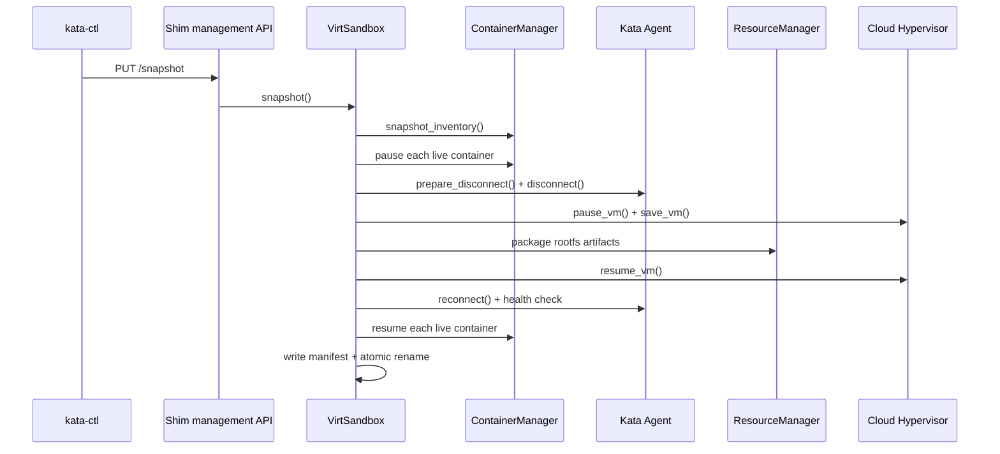
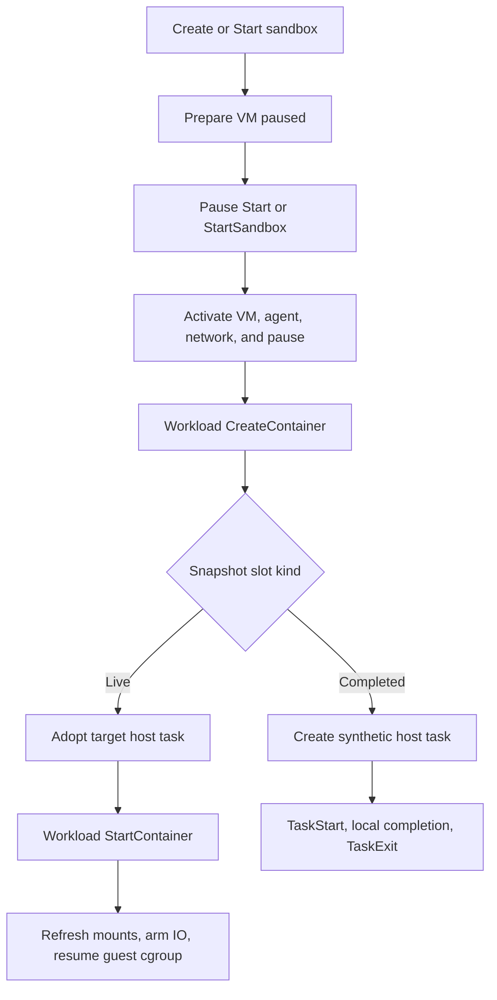

# RUNTIME-RS SNAPSHOT/RESTORE CALL STACKS AND STATE

## 1. Scope

This document is an implementation walkthrough of the runtime-rs packaged
snapshot and restore path as implemented at the end of Phase 5:

- capturing a self-contained snapshot while preserving source availability;
- restoring Cloud Hypervisor in the paused state;
- activating the VM, agent, pause task, and target network at sandbox start;
- matching and adopting each live workload independently;
- synthesizing containers that had already completed at snapshot time;
- translating target host IDs to stable guest-agent IDs;
- refreshing target-generation copied mounts before workload resume;
- persisting restore claims, completion records, and ID mappings;
- preserving stable guest IDs through recursive snapshot and restore.

The implementation deliberately does not use a last-start barrier, collective
container rebind, or Pod-wide finalization transaction. After sandbox
activation, each live container is resumed by its own successful Start request.

## 2. High-Level Model

Snapshot is one exclusive sandbox transaction:



Restore is split into sandbox-wide activation and per-container lifecycle:



The key identity rule is:

```text
target host ID H1 -> stable guest ID G
recursive target host ID H2 -> the same stable guest ID G
```

Containerd and host-facing events use `H1` or `H2`. Agent RPCs continue to use
`G`, because the process and cgroup captured inside the guest already exist
under that ID.

## 3. Snapshot Call Stack

### 3.1 CLI and shim entry

1. `kata-ctl snapshot create` validates the destination and sends it to the shim
   management socket with `PUT /snapshot`:
   [snapshot_ops.rs](src/tools/kata-ctl/src/ops/snapshot_ops.rs).

2. The shim routes the request to `snapshot_handler()`. The handler takes the
   exclusive side of `operation_lock`, preventing concurrent mutating task or
   sandbox operations during capture:
   [handlers.rs](src/runtime-rs/crates/runtimes/src/shim_mgmt/handlers.rs).

3. The handler calls `VirtSandbox::snapshot()`, which delegates to
   `create_portable_snapshot()`:
   [sandbox.rs](src/runtime-rs/crates/runtimes/virt_container/src/sandbox.rs),
   [sandbox.rs](src/runtime-rs/crates/runtimes/virt_container/src/sandbox.rs).

### 3.2 Destination and staging

`create_portable_snapshot()` requires a new, absolute, lexically clean
destination beneath an already-canonical parent. It creates a mode-0700 sibling
staging directory and does all work there:
[sandbox.rs](src/runtime-rs/crates/runtimes/virt_container/src/sandbox.rs).

The final artifact is not visible at the requested destination until all
capture and source-recovery steps have succeeded.

### 3.3 Container inventory

The sandbox asks the container manager for a typed inventory:
[manager.rs](src/runtime-rs/crates/runtimes/virt_container/src/container_manager/manager.rs).

For each host task, `snapshot_container_lifecycle()` computes a canonical OCI
identity and classifies its current state:

- `Running` or `Paused` becomes a live record.
- `Stopped` workload tasks become completed records.
- Transitional states such as `Created` reject the snapshot.
- A stopped sandbox/pause task is not converted into a completed workload.

The classifier is here:
[manager.rs](src/runtime-rs/crates/runtimes/virt_container/src/container_manager/manager.rs).

Each live record contains:

- current host/containerd ID;
- stable guest-agent ID;
- exact CRI name;
- canonical OCI identity version and SHA-256;
- copied node-local mount mappings.

Cold containers obtain mount mappings from their `Volume` objects. Restored
containers obtain them from `RestoreContext`, because an adopted container does
not recreate the source-generation volume objects:
[manager.rs](src/runtime-rs/crates/runtimes/virt_container/src/container_manager/manager.rs).

The stable guest ID comes from `Container::agent_container_id()`:
[container.rs](src/runtime-rs/crates/runtimes/virt_container/src/container_manager/container.rs).

### 3.4 Quiescing the source

The transaction records which stages have completed so recovery reverses only
work that actually happened:
[sandbox.rs](src/runtime-rs/crates/runtimes/virt_container/src/sandbox.rs).

The ordering is part of the snapshot protocol:

1. Suspend health-check activity.
2. Pause every live guest container cgroup while the agent is reachable.
3. Drain agent writes and disconnect the transport.
4. Wait for the guest agent to return to listening state.
5. Pause the VM.

The implementation is here:
[sandbox.rs](src/runtime-rs/crates/runtimes/virt_container/src/sandbox.rs).

`Container::pause()` sends the stable guest ID stored in the init process, so
this works after one or more restore generations:
[container.rs](src/runtime-rs/crates/runtimes/virt_container/src/container_manager/container.rs).

`KataAgent::prepare_disconnect()` changes the connection state before waiting
for non-replayable writes to drain, preventing new writes from entering the old
generation:
[mod.rs](src/runtime-rs/crates/agent/src/kata/mod.rs).

`disconnect()` closes the old TTRPC transport and waits for reconnectable calls
to quiesce before the VM can be paused:
[mod.rs](src/runtime-rs/crates/agent/src/kata/mod.rs).

### 3.5 VM and rootfs capture

Runtime-rs persists normal sandbox state, creates the CLH staging directory,
and calls `Hypervisor::save_vm()`:
[sandbox.rs](src/runtime-rs/crates/runtimes/virt_container/src/sandbox.rs).

The Cloud Hypervisor implementation calculates a memory-sensitive timeout and
invokes the CLH snapshot API:
[inner_hypervisor.rs](src/runtime-rs/crates/hypervisor/src/ch/inner_hypervisor.rs).

The resource manager packages rootfs artifacts only for active host IDs:
[manager.rs](src/runtime-rs/crates/resource/src/manager.rs),
[mod.rs](src/runtime-rs/crates/resource/src/rootfs/mod.rs).

For a cold EROFS container, `package_snapshot_artifacts()` copies immutable
layers, creates a portable VMDK descriptor where needed, and reflink-copies the
writable layer:
[erofs_rootfs.rs](src/runtime-rs/crates/resource/src/rootfs/erofs_rootfs.rs).

For an already-restored container, `RestoredRootfs::snapshot_artifacts()` uses
the current host ID as the next artifact directory while preserving the stable
guest ID:
[restored_rootfs.rs](src/runtime-rs/crates/resource/src/rootfs/restored_rootfs.rs).

`finalize_snapshot_config()` rewrites CLH disk paths from live files to the
packaged files. When CLH emits `memory-ranges`, it removes both
`memory.file` and every `memory.zones[].file` host-local backing reference. It
also removes detached restored-container disks that are not part of the new
artifact, recognizing snapshot paths beneath the configured `snapshot_root` as
well as private `/restore/containers/` paths:
[snapshot.rs](src/runtime-rs/crates/resource/src/rootfs/snapshot.rs).

The current runtime state is copied into the artifact as
`runtime-state.json` after VM and rootfs capture:
[sandbox.rs](src/runtime-rs/crates/runtimes/virt_container/src/sandbox.rs).

### 3.6 Source recovery

Recovery runs in reverse dependency order:

1. Resume the VM.
2. Reconnect the agent with the exact generation token.
3. Health-check the new transport generation.
4. Resume live containers in reverse pause order.
5. Resume health monitoring.

See
[sandbox.rs](src/runtime-rs/crates/runtimes/virt_container/src/sandbox.rs).

The generation token prevents a stale or unrelated reconnect from attaching to
the saved guest state:
[mod.rs](src/runtime-rs/crates/agent/src/kata/mod.rs).

If capture fails, recovery still runs. If recovery fails, a successful capture
is treated as a failed snapshot transaction. No artifact is published while
the source is known to be broken.

### 3.7 Manifest and atomic publication

After source recovery, runtime-rs builds the file inventory and joins rootfs
artifacts to live container identities by current host ID:
[sandbox.rs](src/runtime-rs/crates/runtimes/virt_container/src/sandbox.rs).

It then adds completed records, writes `kata-snapshot.json`, and atomically
renames the staging directory to the requested destination:
[sandbox.rs](src/runtime-rs/crates/runtimes/virt_container/src/sandbox.rs).

The published artifact therefore contains:

```text
kata-snapshot.json
runtime-state.json
clh/config.json
clh/state.json
clh/memory-ranges             # when emitted by CLH
containers/<host-id>/...      # packaged readonly graph and writable layer
```

## 4. Restore Call Stack

Restore is three related call stacks rather than one Pod-wide transaction:

1. prepare the sandbox and restore CLH paused;
2. activate VM, agent, network, and pause task at sandbox start;
3. adopt or synthesize each workload through its own Create and Start.

### 4.1 Restore preparation entry

In task API mode, the first pause-task Create reaches
`handler_task_message()`, which calls `sandbox.start()` before creating host
bookkeeping:
[manager.rs](src/runtime-rs/crates/runtimes/src/manager.rs).

In sandbox API mode, `StartSandbox` calls the same `sandbox.start()`:
[manager.rs](src/runtime-rs/crates/runtimes/src/manager.rs).

`VirtSandbox::start()` checks the restore annotation before factory cloning or
cold boot. If restore preparation succeeds, it returns with CLH paused:
[sandbox.rs](src/runtime-rs/crates/runtimes/virt_container/src/sandbox.rs).

### 4.2 Annotation and manifest validation

`restore_source_from_annotations()` resolves the snapshot name beneath the
configured `snapshot_root`, which defaults to `/var/lib/kata/snapshots`. It
rejects empty or multi-component names, non-directories, and symlinked or
non-canonical paths:
[sandbox.rs](src/runtime-rs/crates/runtimes/virt_container/src/sandbox.rs).

`load_restore_manifest()` validates:

- the required root-level `runtime_version` (distro package release when
  supplied, otherwise Kata version) exactly matches the current runtime;
- the required numeric `format_version` selects the snapshot manifest schema
  parser before parsing and validating the remaining version-specific contract;
- format, producer, hypervisor, and transport contracts;
- every declared file and its size;
- required CLH and runtime-state files;
- unique CRI names, source host IDs, and guest IDs;
- exactly one live `POD` slot matching the source sandbox ID;
- canonical OCI identity versions and hash syntax;
- clean and trusted node-local mount mappings;
- readonly/writable disk declarations;
- no overlap between live and completed names.

See
[sandbox.rs](src/runtime-rs/crates/runtimes/virt_container/src/sandbox.rs).

### 4.3 Restore slot initialization

Manifest live and completed entries are converted into `RestoreLiveSlot` and
`RestoreCompletedSlot`, then passed to `RestoreContext::begin()`:
[sandbox.rs](src/runtime-rs/crates/runtimes/virt_container/src/sandbox.rs).

`begin()` validates the slot collections, indexes them by exact CRI name, and
transitions `Cold -> RestoringPaused`:
[restore.rs](src/runtime-rs/crates/runtimes/virt_container/src/restore.rs).

At this point no target workload IDs exist. Live slots know only their stable
guest IDs and canonical identities.

### 4.4 Private disk and rootfs reconstruction

`prepare_restore_source()`:

- creates the target sandbox's private restore directory;
- copies the CLH config;
- symlinks immutable state and memory-range files;
- reflink-clones each writable disk;
- rewrites CLH disk paths by saved disk ID.

See
[sandbox.rs](src/runtime-rs/crates/runtimes/virt_container/src/sandbox.rs).

`restored_rootfs_configs()` reconstructs resource-manager records from the
manifest. Immutable files continue to reference the packaged snapshot;
writable files reference the private clones:
[sandbox.rs](src/runtime-rs/crates/runtimes/virt_container/src/sandbox.rs).

Registration enters the rootfs resource graph through
`ResourceManager::register_restored_rootfs()`:
[manager.rs](src/runtime-rs/crates/resource/src/manager.rs),
[mod.rs](src/runtime-rs/crates/resource/src/rootfs/mod.rs).

### 4.5 Target network preparation

The saved CLH config supplies the saved network device ID and queue count.
Runtime-rs enters the target netns, constructs the target endpoint, opens its
TAP queues, and returns a `RestoreNetworkConfig` carrying the saved device ID
and target FDs. `RestoreVmRequest` accepts a vector of these configs, while the
current artifact validator requires exactly one saved network device:
[manager_inner.rs](src/runtime-rs/crates/resource/src/manager_inner.rs).

Traffic remains fenced until target identity has been installed and verified
inside the guest.

### 4.6 Cloud Hypervisor paused restore

Runtime-rs rejects virtio-mem with copy-on-write restore, then calls
`restore_vm(RestoreVmRequest)` with the private CLH directory and target network
FDs:
[sandbox.rs](src/runtime-rs/crates/runtimes/virt_container/src/sandbox.rs).

The CLH implementation:

1. starts the VMM server;
2. prepares target-private restore files;
3. sends the saved network device IDs and replacement TAP FDs;
4. invokes the CLH restore API;
5. verifies CLH reports `Paused`.

See
[inner_hypervisor.rs](src/runtime-rs/crates/hypervisor/src/ch/inner_hypervisor.rs)
and
[inner_hypervisor.rs](src/runtime-rs/crates/hypervisor/src/ch/inner_hypervisor.rs).

Runtime-rs then transitions `RestoringPaused -> PreparedPaused`, persists the
sandbox, and starts a background VMM exit waiter:
[sandbox.rs](src/runtime-rs/crates/runtimes/virt_container/src/sandbox.rs).

### 4.7 Sandbox activation entry

Activation may be requested by either:

- pause `StartProcess` in task API mode:
  [manager.rs](src/runtime-rs/crates/runtimes/src/manager.rs);
- `StartSandbox` in sandbox API mode:
  [manager.rs](src/runtime-rs/crates/runtimes/src/manager.rs).

In task API mode, pause Create first claims the live `POD` slot while CLH is
still `PreparedPaused`; the later pause Start owns activation. In sandbox API
mode, `StartSandbox` owns activation without a host pause task.

`activate_restore_transaction()` takes `activation_lock`. Only the target
sandbox ID may transition `PreparedPaused -> Activating`:
[sandbox.rs](src/runtime-rs/crates/runtimes/virt_container/src/sandbox.rs),
[restore.rs](src/runtime-rs/crates/runtimes/virt_container/src/restore.rs).

After activation has completed, workload IDs receive `Ok(false)` from
`begin_activation()` and continue into their normal container-manager Start
dispatch. They do not rerun sandbox activation.

### 4.8 VM, agent, and guest housekeeping

Activation resumes CLH, opens a new agent connection, health-checks it, reseeds
the guest RNG, and synchronizes guest time:
[sandbox.rs](src/runtime-rs/crates/runtimes/virt_container/src/sandbox.rs).

All captured workload cgroups remain paused while this occurs.

### 4.9 Network identity replacement

The resource manager reads the target CNI interface and routes and sets the
private restore-replace flag:
[manager_inner.rs](src/runtime-rs/crates/resource/src/manager_inner.rs).

The guest agent recognizes the flag and calls
`prepare_restore_interface()`:
[rpc.rs](src/agent/src/rpc.rs).

That guest operation takes the restored interface down, deletes stale
addresses, and removes routes belonging to that link before the ordinary
interface update installs target state:
[netlink.rs](src/agent/src/netlink.rs).

Runtime-rs reads the interface back and proves:

- the target MAC is present;
- every target address is present;
- every source-only address is absent.

Only after this proof does it activate the fenced network redirects:
[sandbox.rs](src/runtime-rs/crates/runtimes/virt_container/src/sandbox.rs).

### 4.10 Pause-task resume and Active transition

Activation obtains the stable pause guest ID. Where a target pause task exists,
it refreshes its target-generation mounts and arms its I/O and waiter before
resume. It then resumes only the pause guest cgroup, marks target pause state
running, starts OOM and health monitoring, transitions `Activating -> Active`,
and persists the sandbox:
[sandbox.rs](src/runtime-rs/crates/runtimes/virt_container/src/sandbox.rs).

Every init and workload cgroup other than pause remains paused.

### 4.11 Per-container Create classification

Restored `CreateContainer` extracts the exact CRI name, computes the target
canonical OCI identity, and calls `RestoreContext::classify_create()`:
[manager.rs](src/runtime-rs/crates/runtimes/virt_container/src/container_manager/manager.rs).

Classification happens under one restore-state mutex:
[restore.rs](src/runtime-rs/crates/runtimes/virt_container/src/restore.rs).

The possible actions are:

- `Cold`: ordinary container creation. This also permits a restart-policy
  replacement after a completed snapshot slot has been consumed.
- `AdoptLive { guest_id, is_pause }`: exact live name and OCI identity match.
- `SyntheticCompleted { exit_code }`: exact completed name and OCI identity
  match.

Pause adoption is allowed in `PreparedPaused` so task API mode can create its
host pause bookkeeping before Start. Workload adoption is rejected until
activation is `Active`. Duplicate claims, unknown names while snapshot slots
remain unclaimed, mismatched identities, and invalid pause identities fail the
restore. Once all snapshot slots are consumed, an unknown CRI name takes the
cold creation path so later Pod containers are not permanently blocked.

### 4.12 Live Create adoption

For `AdoptLive`, runtime-rs creates only host-side `Container` and `Process`
bookkeeping. It does not issue guest `CreateContainer`:
[manager.rs](src/runtime-rs/crates/runtimes/virt_container/src/container_manager/manager.rs).

The adopted process receives the stable guest ID with
`set_agent_container_id()`. The restored rootfs record is rekeyed from the
source host ID to the new target host ID:
[container.rs](src/runtime-rs/crates/runtimes/virt_container/src/container_manager/container.rs),
[mod.rs](src/runtime-rs/crates/resource/src/rootfs/mod.rs).

`RestoreContext` simultaneously records:

```text
host_to_guest[target_host_id] = snapshot_guest_id
guest_to_host[snapshot_guest_id] = target_host_id
```

Later exec processes created in an adopted container copy the init process's
stable guest container ID while retaining their target-generation exec IDs.

### 4.13 Live Start

For an adopted init process, `ContainerManager::start_process()` resolves the
target host ID to its stable guest ID:
[manager.rs](src/runtime-rs/crates/runtimes/virt_container/src/container_manager/manager.rs).

Before resume, `prepare_restored_container()`:

1. retrieves saved guest mount mappings for the claimed slot;
2. finds each matching destination in the target OCI spec;
3. obtains the target node's mount source;
4. refreshes that source into the existing guest path;
5. arms I/O streams and the process waiter.

See
[manager.rs](src/runtime-rs/crates/runtimes/virt_container/src/container_manager/manager.rs)
and
[container.rs](src/runtime-rs/crates/runtimes/virt_container/src/container_manager/container.rs).

The resource layer canonicalizes and validates each target source, asks the
guest to clear the old path, then copies file or directory contents:
[share_fs_volume.rs](src/runtime-rs/crates/resource/src/volume/share_fs_volume.rs).

The guest `PrepareGuestMount` handler confines operations beneath
`/run/kata-containers`, rejects symlinks and type mismatches, and truncates or
empties the existing destination:
[rpc.rs](src/agent/src/rpc.rs).

Only after all fallible setup succeeds does runtime-rs call
`ResumeContainer(guest_id)`. It then marks the target task `Running`. The outer
task handler publishes `TaskStart` and returns success.

No later container request is required before the resumed workload can serve
probes.

### 4.14 Synthetic completed Create and Start

For `SyntheticCompleted`, Create builds only local host bookkeeping. It does not
create rootfs, devices, mounts, or a guest process:
[manager.rs](src/runtime-rs/crates/runtimes/virt_container/src/container_manager/manager.rs).

The init waiter is registered once during task Create, before `TaskCreate` is
published:
[manager.rs](src/runtime-rs/crates/runtimes/src/manager.rs).

On Start:

1. `ContainerManager::start_process()` marks the synthetic task running.
2. The task handler publishes `TaskStart`.
3. `complete_synthetic_init()` consumes the captured exit code exactly once.
4. `Process::complete_locally()` records target-generation exit time, changes
  state to stopped, and drops the watcher sender.
5. Closing that watcher releases the existing waiter, which emits exactly one
  `TaskExit`.

See
[manager.rs](src/runtime-rs/crates/runtimes/virt_container/src/container_manager/manager.rs),
[manager.rs](src/runtime-rs/crates/runtimes/src/manager.rs),
[process.rs](src/runtime-rs/crates/runtimes/virt_container/src/container_manager/process.rs),
and
[sandbox.rs](src/runtime-rs/crates/runtimes/virt_container/src/sandbox.rs).

State, Wait, Kill, and Delete remain local for that synthetic task. After Delete,
the slot is retired so a restart-policy replacement with the same CRI name may
take the cold creation path.

### 4.15 Completion tombstones

When an ordinary workload task is deleted in stopped state, runtime-rs records
its CRI name, exit code, and canonical OCI identity in `RestoreContext`:
[manager.rs](src/runtime-rs/crates/runtimes/virt_container/src/container_manager/manager.rs).

This small record survives removal of the ordinary task object. A newer live
creation with the same CRI name removes the old completion record. At snapshot
time, a live task always takes precedence over a stale completed record.

### 4.16 Recursive snapshot and restore

Adoption changes only the restored rootfs record's current host ID:
[restored_rootfs.rs](src/runtime-rs/crates/resource/src/rootfs/restored_rootfs.rs).

`RestoredRootfs::snapshot_artifacts()` emits:

- `source_host_id`: the current target-generation host ID;
- `snapshot_guest_id`: the original stable guest ID.

See
[restored_rootfs.rs](src/runtime-rs/crates/resource/src/rootfs/restored_rootfs.rs).

The container inventory independently obtains the same stable guest ID from the
dual-identity `Process`. A later restore therefore claims a new target host ID
without changing the guest identity embedded in the running guest process.

## 5. State Inventory

The end-of-Phase-5 state falls into four ownership scopes:

1. snapshot-time typed inventory in runtime memory;
2. self-contained artifact manifest state;
3. live and persisted restore coordination state;
4. transport, hypervisor, rootfs, and process leaf state.

### 5.1 Snapshot-time typed inventory

Definitions:
[types/mod.rs](src/runtime-rs/crates/runtimes/common/src/types/mod.rs).

#### `CompletedContainerSnapshot`

```rust
pub struct CompletedContainerSnapshot {
    pub cri_name: String,
    pub exit_code: i32,
    pub oci_identity_version: u32,
    pub oci_identity_sha256: String,
}
```

This is the minimal tombstone needed to reproduce a completed task without
re-running it.

#### `ContainerSnapshotMount`

```rust
pub struct ContainerSnapshotMount {
    pub destination: String,
    pub guest_source: String,
}
```

`destination` is the semantic OCI mount destination. `guest_source` is the
existing path inside the captured guest that must receive target-generation
content before resume. The node-local host source is intentionally not stored.

#### `LiveContainerSnapshot`

```rust
pub struct LiveContainerSnapshot {
    pub host_id: String,
    pub guest_id: String,
    pub cri_name: String,
    pub oci_identity_version: u32,
    pub oci_identity_sha256: String,
    pub node_local_mounts: Vec<ContainerSnapshotMount>,
}
```

The distinct `host_id` and `guest_id` fields make recursive snapshots possible.
These transient inventory fields remain strings because they are immediately
serialized into the artifact contract. Runtime control flow converts them to
role-specific IDs before matching, mapping, or agent routing.

#### `ContainerSnapshotInventory`

```rust
pub struct ContainerSnapshotInventory {
    pub live_containers: Vec<LiveContainerSnapshot>,
    pub completed_containers: Vec<CompletedContainerSnapshot>,
}
```

This is transient snapshot input, not an on-disk format.

#### `SnapshotContainerLifecycle`

The private classifier result is either live identity data or a completed
record:
[manager.rs](src/runtime-rs/crates/runtimes/virt_container/src/container_manager/manager.rs).

### 5.2 Artifact manifest state

Definitions:
[sandbox.rs](src/runtime-rs/crates/runtimes/virt_container/src/sandbox.rs).

All manifest structs use `#[serde(deny_unknown_fields)]`.

#### `SnapshotFileManifest`

Relative artifact path and expected byte size. It is a structural file
inventory, not a claimed payload-integrity hash.

#### `SnapshotLiveContainerManifest`

Contains:

- exact CRI name;
- source-generation host ID;
- stable guest ID;
- canonical OCI identity;
- node-local mount mappings;
- saved CLH readonly disk ID and packaged path;
- optional writable disk ID and packaged path.

#### `SnapshotMountManifest`

Contains the OCI destination and stable guest path for one copied mount.

#### `SnapshotCompletedContainerManifest`

Contains exact CRI name, captured exit code, and canonical OCI identity.

#### `SnapshotAgentTransportManifest`

Records the transport contract version, `disconnected-listening` state, server
port, and log port captured in the VM state.

#### `SnapshotManifest`

Top-level contract containing format version, producer, hypervisor, source
sandbox ID, transport state, live records, completed records, and files.

#### `SavedRestoreNetwork`

A transient parsed representation of the single saved CLH network device ID and
TAP queue count. It is derived from packaged `clh/config.json`.

### 5.3 Restore coordination state

Definitions:
[restore.rs](src/runtime-rs/crates/runtimes/virt_container/src/restore.rs).

#### `HostContainerId` and `GuestContainerId`

The two new types are defined in
[types/mod.rs](src/runtime-rs/crates/runtimes/common/src/types/mod.rs) and make
the identity role compiler-visible:

```rust
pub struct HostContainerId(String);
pub struct GuestContainerId(String);
```

`HostContainerId` names the current containerd generation. `GuestContainerId`
names the process and cgroup already present in the captured guest. Manifest
and agent wire types remain strings, but restore matching and translation use
these wrappers before converting at the transport boundary.

#### `RestoreActivation`

```text
Cold
  -> RestoringPaused
  -> PreparedPaused
  -> Activating
  -> Active

Any terminal restore failure -> Failed
```

- `Cold`: ordinary sandbox, no restore contract loaded.
- `RestoringPaused`: slots loaded and paused restore preparation is in progress.
- `PreparedPaused`: CLH restored paused and sandbox state persisted.
- `Activating`: one caller owns VM/agent/network activation.
- `Active`: workload slots may be adopted and started independently.
- `Failed`: the restore attempt is terminal.

#### `RestoreIdentity`

Version plus canonical OCI SHA-256. It identifies runtime semantics, not image
or artifact bytes.

#### `RestoreGuestMount`

In-memory and persisted destination-to-guest-path mapping used for target input
refresh.

#### `RestoreLiveSlot`

Manifest-derived initialization DTO containing CRI name, stable guest ID,
canonical identity, and mount mappings.

#### `RestoreCompletedSlot`

Manifest-derived initialization DTO containing CRI name, exit code, and
canonical identity.

#### `RestoreCreateAction`

The result of exact Create classification:

```rust
Cold
AdoptLive { guest_id, is_pause }
SyntheticCompleted { exit_code }
```

#### `LiveSlotState`

Persisted live slot data:

- stable guest ID;
- canonical identity;
- optional claimed target host ID;
- copied mount mappings.

#### `CompletedSlotState`

Persisted completed slot data:

- captured exit code;
- canonical identity;
- optional claimed target host ID;
- `completion_pending`, enforcing one local completion;
- `restore_available`, allowing the consumed slot to fall back to cold restart.

Manifest initialization sets both flags. `take_synthetic_exit_code()` clears
`completion_pending` exactly once. Deleting the synthetic task calls
`retire_synthetic_completed()`, which clears its claim and `restore_available`;
a later restart-policy replacement with the same CRI name then uses cold
creation.

#### `RestoreState`

Contains:

- activation phase;
- source sandbox ID;
- live slots keyed by CRI name;
- completed slots keyed by CRI name;
- `HashMap<HostContainerId, GuestContainerId>` for outbound agent routing;
- `HashMap<GuestContainerId, HostContainerId>` for inbound event routing.

The reverse map is used for guest-originated events. For example, OOM events are
translated before publication:
[sandbox.rs](src/runtime-rs/crates/runtimes/virt_container/src/sandbox.rs).

#### `RestorePersistState`

A versioned wrapper around `RestoreState`. Versioning makes incompatible future
changes reject cleanly rather than silently misinterpreting mappings.

#### `RestoreContext`

The shared owner of restore state:

- immutable target sandbox ID;
- mutex-protected `RestoreState`;
- activation single-flight mutex.

It is shared by `VirtSandbox` and `VirtContainerManager`:
[sandbox.rs](src/runtime-rs/crates/runtimes/virt_container/src/sandbox.rs),
[manager.rs](src/runtime-rs/crates/runtimes/virt_container/src/container_manager/manager.rs).

It also owns ordinary completed tombstones after task deletion, even for a cold
sandbox. Absence of restore activation still leaves completion inventory
available for a later snapshot.

### 5.4 Canonical OCI identity DTOs

Serialization-only DTOs are defined at
[restore.rs](src/runtime-rs/crates/runtimes/virt_container/src/restore.rs):

- `CanonicalMount`;
- `CanonicalNamespace`;
- `CanonicalCapabilities`;
- `CanonicalProcess`;
- `CanonicalLinuxResources`;
- `CanonicalLinux`;
- `CanonicalOciIdentity`.

They normalize unordered maps, reject hooks, and exclude host-local rootfs and
mount source paths. The final versioned SHA-256 is produced by
`canonical_oci_identity()`:
[restore.rs](src/runtime-rs/crates/runtimes/virt_container/src/restore.rs).

Snapshot rootfs contents are authoritative. This hash answers whether the target
OCI semantics match the captured process, not whether registry tags or host
rootfs bytes are unchanged.

### 5.5 Dual process identity

`Process` stores both identities:
[process.rs](src/runtime-rs/crates/runtimes/virt_container/src/container_manager/process.rs).

```text
process       = host/containerd-facing ContainerProcess
agent_process = guest-agent-facing ContainerProcess
```

For cold containers they start equal. Adoption changes only `agent_process` to
the stable guest ID.

The same struct owns:

- host-visible PID and bundle;
- standard I/O paths and retained FIFO handles;
- terminal dimensions;
- process status;
- exit code and exit time;
- one watcher sender and receiver;
- optional passfd state.

Agent operations derive IDs from `agent_process`. Examples include exec and TTY
resize:
[container_inner.rs](src/runtime-rs/crates/runtimes/virt_container/src/container_manager/container_inner.rs).

Signal and cleanup paths also translate to the guest identity:
[container_inner.rs](src/runtime-rs/crates/runtimes/virt_container/src/container_manager/container_inner.rs).

Pause, resume, stats, and update use `init_agent_container_id()`:
[container.rs](src/runtime-rs/crates/runtimes/virt_container/src/container_manager/container.rs).

Host-facing `State`, `TaskStart`, `TaskExit`, and `TaskOOM` retain target IDs.

### 5.6 Restored rootfs state

Generic snapshot artifact types are defined at
[mod.rs](src/runtime-rs/crates/resource/src/rootfs/mod.rs).

#### `SnapshotDiskPath`

Pairs a current live disk path with its packaged snapshot destination.

#### `RootfsSnapshotArtifacts`

Contains CRI name, current host ID, stable guest ID, readonly disk, optional
writable disk, and all copied files.

Restored-rootfs types are defined at
[restored_rootfs.rs](src/runtime-rs/crates/resource/src/rootfs/restored_rootfs.rs).

#### `RestoredRootfsConfig`

Construction input built from the artifact manifest:

- CRI name;
- source/current host ID;
- stable guest ID;
- packaged readonly disk;
- private writable disk;
- complete packaged file graph.

#### `RestoredRootfsIdentity`

Mutex-protected pair of current host ID and stable guest ID. Adoption updates
only the host ID.

#### `RestoredRootfs`

A `Rootfs` implementation that represents already-attached storage in the
restored VM. It performs no new guest mount or device setup. Its principal jobs
are:

- retain the artifact graph for cleanup and recursive snapshot;
- rekey current host ownership after adoption;
- emit the original guest ID on recursive snapshot.

### 5.7 Persistent sandbox state

`SandboxState` now contains:

```rust
pub struct SandboxState {
    pub sandbox_type: String,
    pub resource: Option<ResourceState>,
    pub hypervisor: Option<HypervisorState>,
    pub(crate) restore: Option<RestorePersistState>,
}
```

Definition:
[sandbox_persist.rs](src/runtime-rs/crates/runtimes/virt_container/src/sandbox_persist.rs).

`VirtSandbox::save()` serializes resource, hypervisor, and restore state into the
normal sandbox persistence file:
[sandbox.rs](src/runtime-rs/crates/runtimes/virt_container/src/sandbox.rs).

`VirtSandbox::restore()` reconstructs `RestoreContext` from that state:
[sandbox.rs](src/runtime-rs/crates/runtimes/virt_container/src/sandbox.rs).

`RestoreContext::from_persist()` rejects unsupported versions, rejects
in-progress transitions that cannot be recovered safely, and proves the two ID
maps are exact inverses:
[restore.rs](src/runtime-rs/crates/runtimes/virt_container/src/restore.rs).

Lifecycle mutations are persisted after:

- container Create:
  [manager.rs](src/runtime-rs/crates/runtimes/src/manager.rs);
- container Start and synthetic completion:
  [manager.rs](src/runtime-rs/crates/runtimes/src/manager.rs);
- process Delete and completion-record update:
  [manager.rs](src/runtime-rs/crates/runtimes/src/manager.rs).

### 5.8 Agent transport state

`AgentDisconnectToken` is a private generation proof:
[lib.rs](src/runtime-rs/crates/agent/src/lib.rs).

`ConnectionStatus` has:

- `Connected`;
- `PlannedDisconnect`;
- `Disconnected`;
- `Reconnecting`;
- `PermanentlyClosed`.

`ConnectionState` pairs that status with a generation number:
[mod.rs](src/runtime-rs/crates/agent/src/kata/mod.rs).

`ActivityKind` and `ActivityGuard` track writes that must drain and observers
that may be rearmed after reconnect. The corresponding counters and notifications
are runtime-only transport synchronization, not persisted snapshot state.

### 5.9 Hypervisor restore state

`RestoreNetworkConfig` contains a saved CLH device ID and target-owned TAP FDs.

`RestoreVmRequest` contains:

- private restore directory;
- memory restore mode;
- a vector of replacement network configs, currently populated with the one
  network required by artifact validation;
- restore timeout.

Definitions:
[lib.rs](src/runtime-rs/crates/hypervisor/src/lib.rs).

The CLH API serializes:

- `RestoreConfig`: source URL, memory mode, and restored network descriptions;
- `RestoredNetConfig`: saved device ID and number of FDs supplied out of band.

Definitions:
[ch_api.rs](src/runtime-rs/crates/hypervisor/ch-config/src/ch_api.rs).

The owned FDs remain host runtime resources. They are not serialized into the
artifact or sandbox state.

### 5.10 Guest mount refresh state

The runtime-side request is:

```rust
pub struct PrepareGuestMountRequest {
    pub path: String,
    pub directory: bool,
}
```

Definition:
[types.rs](src/runtime-rs/crates/agent/src/types.rs).

The TTRPC contract is defined at
[agent.proto](src/libs/protocols/protos/agent.proto).

This request does not create durable guest metadata. It is a constrained
pre-copy operation against an already-existing trusted guest path.

## 6. Important Invariants

1. A successful snapshot implies both artifact capture and source recovery
   succeeded.
2. Every live guest container cgroup is paused before agent disconnect and VM
   capture.
3. CLH restore must return with the VM paused.
4. Guest workloads remain cgroup-paused during target network replacement.
5. Network traffic is activated only after guest MAC/address readback proves
   target identity and stale source identity is absent.
6. Only pause is resumed during sandbox activation.
7. A live workload Start performs all fallible mount and I/O setup before
   `ResumeContainer(guest_id)`.
8. A successful live Start corresponds to an immediately usable resumed guest
   process. No later container request gates it.
9. Completed containers never issue guest create, start, mount, device, or
   process RPCs.
10. Synthetic completion publishes `TaskStart` before exactly one `TaskExit`.
11. Exact CRI name and canonical OCI identity are both required to claim a
    snapshot slot.
12. Host-facing state uses target IDs; agent RPCs use stable guest IDs.
13. Guest-originated events are reverse-translated before host publication.
14. Packaged rootfs and private writable clones are authoritative for restored
    container contents.
15. Node-local mount source paths are target-generation inputs and are refreshed
    before live cgroup resume.
16. Recursive snapshots rekey only host IDs and preserve guest IDs.
17. Restore state, claims, completed records, and both ID maps are persisted in
    normal sandbox state.
18. OCI hooks are rejected for snapshot restore because replay semantics are not
    defined.
19. Payload SHA-256 values and resolved-image annotations are not part of this
    runtime identity contract.

## 7. Failure Boundaries

### Snapshot failure

- VM resume is attempted if VM pause succeeded.
- Agent reconnect is attempted only after VM resume.
- Container resume and monitor resume require a healthy agent generation.
- Staging is removed on capture, recovery, or publication failure.
- The final destination is never published after failed source recovery.

### Restore preparation failure

- `RestoreContext` becomes `Failed`.
- The launched VMM is stopped.
- Network and resource-manager state are cleaned up.
- Private restore storage is removed after successful VMM teardown. If VMM
  teardown fails, it is deliberately preserved because the VMM may still be
  using those files.

### Restore activation failure

- `RestoreContext` becomes `Failed`.
- Agent transport is disconnected.
- The VMM is stopped.
- Network/resource state and private storage are cleaned up after successful
  VMM teardown. Private storage is preserved if stopping the VMM fails.

### Container adoption failure

- Unknown names, duplicate claims, identity mismatch, unsupported hooks, and
  mount reconciliation errors reject the request.
- The restore attempt is marked failed because the requested Pod cannot be made
  equivalent to the captured contract.

### Container start failure

- Failures before `ResumeContainer` leave the guest cgroup paused.
- Runtime-rs does not mark the target task running before guest resume succeeds.
- No Pod-wide last-start rollback or finalization state exists.
