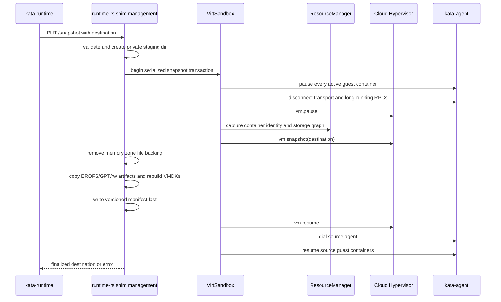

# Runtime-rs Snapshot/Restore Port Design

Status: design only

Date: 2026-08-18

Runtime-rs baseline: PR #530, the three commits after `89c0031689`, from
`b67d57f864` through `c20ac54ad8` inclusive. This baseline implements and tests
Cloud Hypervisor factory templating before the snapshot/restore port begins.

Go source changeset: `c20ac54ad8..96e280598f`. In Git's `A..B` syntax the
runtime-rs baseline commit is excluded; the range contains the 14 rebased Go
commits from `82389bfa9c` through `96e280598f` inclusive.

Combined branch delta: `89c0031689..96e280598f`, containing the three PR #530
runtime-rs baseline commits followed by the 14 source commits being ported.

Target: `kata-runtime-rs`, Cloud Hypervisor, containerd/CRI, and Kubernetes.

## 1. Executive summary

The Go changeset implements two related operations:

1. Snapshot a live sandbox through the shim management socket. The shim pauses
   the VM, persists Kata state, asks Cloud Hypervisor (CLH) to write a snapshot,
   makes the artifact portable, and resumes the source VM.
2. Restore that artifact through a normal CRI `RunPodSandbox` flow selected by
  `io.katacontainers.restore-from`. The new shim prepares the packaged storage,
  restores the VM paused, binds its saved NIC to the target pod's TAP file
  descriptors, adopts the pause and workload containers without recreating
  them in the guest, synthetically completes compatible one-shot init
  containers, and stages regular workload starts. Every incoming container
  must match its checkpointed image manifest digest and canonical OCI identity
  before adoption. The last expected regular-container `StartContainer`
  commits the restore: runtime-rs resumes the VMM while restored workload
  cgroups remain frozen, dials the agent, atomically rebinds sandbox/container
  identities and fresh node-local inputs, performs post-restore housekeeping,
  and only then exposes traffic and resumes all workloads.

PR #530 materially changes the starting point. Runtime-rs now has working CLH
factory creation and restore, real `vm.pause`, `vm.resume`, `vm.snapshot`, and
`vm.restore` API calls, file-backed template memory zones, private config/state
copies, vsock path rebasing, source-template teardown, and Kubernetes coverage.
These are reusable foundations, not work to recreate.

The remaining architectural problem is that those operations are still coupled
to `vm_template` paths and flags: `save_vm()` is pathless, restore is private to
the CLH `start_vm()` template branch, and that branch immediately resumes the
VM. The first porting phase therefore applies the same separation introduced by
Go commit `82389bfa9c` (`1d938157c5` before the rebase) to existing Rust code.

The implementation must port the final behavior, not replay each Go commit
literally. In particular:

- Checkpoint/restore COW must use CLH `memory_restore_mode=copyonwrite` with no
  memory-zone `file` in the saved `config.json`. The earlier file-backing
  rewrite was reversed by `73736fd1b7`.
- Runtime-rs VMDK descriptors make the Go filename-copy algorithm unsuitable.
  Runtime-rs needs a versioned storage manifest and must regenerate VMDK
  descriptors against artifact-local extents.
- Multi-container adoption and atomic guest identity rebinding should be
  present in the first enabled restore implementation. Do not first implement
  the single-workload limitation that `04e3cfa60f` later removed, and do not
  retain the Go runtime's permanent host-side canonical-ID translation after a
  successful rebind.
- Before snapshotting, pause all active guest containers and intentionally
  disconnect the agent transport. After snapshotting, reconnect the source
  agent and resume the source containers. This avoids capturing stale long-lived
  agent RPC transports and gives restore a frozen-workload window in which to
  dial and rebind the restored agent.
- Compatible non-restartable init containers are one-shot. On restore they are
  represented as synthetic host tasks that transition through start to a
  successful exit without guest RPCs. Restartable init containers/sidecars are
  initially unsupported.
- Rebinding must refresh supported node-local inputs and mounts, including
  hosts/hostname/resolver data, Secrets, ConfigMaps, projected volumes,
  downward API, service-account tokens, and termination-log mappings. The Go
  restore path updates host bookkeeping but skips these guest/device effects;
  runtime-rs must not preserve that gap.
- Restore must be transactional from its first implementation. Do not port the
  orphan-prone behavior that `ea3c55de2b` later repaired.
- Do not port the Go hybrid-vsock backoff change (`a25ef839db`) initially.
  Cameron will manually measure runtime-rs restore reconnect latency and change its dialer only if a
  comparable delay is reproduced.
- There is no snapshot delete API in the final design. The external controller
  owns artifact retention and deletion.

The work is condensed into five phases:

1. Decouple the existing CLH template primitives and add restore-mode support.
2. Portable, transactional snapshot artifacts with VMDK-aware storage capture.
  Phase 2.1 closes the mandatory source-agent disconnect/reconnect gap before
  restore work begins.
3. Atomic annotation-driven paused restore and network handoff.
4. Multi-container adoption and recursive identity/storage correctness.
5. Failure injection, performance validation, security hardening, and rollout.

Phases 3 and 4 must remain behind the same feature gate until both are complete.

## 2. Scope and non-goals

### In scope

- PR #530 commits `b67d57f864`, `7f921dcab6`, and `c20ac54ad8` as the
  implemented runtime-rs baseline to preserve and reuse.
- All 14 Go source commits in `c20ac54ad8..96e280598f`.
- The generic save/restore refactor from `82389bfa9c`.
- CLH `memory_restore_mode` and virtio-mem compatibility from `837f614d23`.
- Native `kata-ctl snapshot create` as the runtime-rs user-facing client. It
  uses `shim_interface::MgmtClient`, accepts a full or unique-prefix sandbox
  ID, and discovers `/run/kata/<sandbox-id>/shim-monitor.sock` without parsing
  a Go runtime configuration. Keep the existing Go command compatible with the
  same endpoint during the transition.
- CLH snapshots restored as Kubernetes-tracked pods through normal CRI task
  creation.
- One restored network endpoint, matching the current Go constraint.
- Multiple workload containers, matched by CRI container name.
- Completed non-restartable init containers, represented through synthetic
  successful task completion without rerunning their guest processes or hooks.
- Atomic guest rebind from snapshot sandbox/container IDs to the IDs assigned
  to the restore Pod.
- Fresh reconciliation of the explicitly supported node-local inputs and
  mounts before restored workloads resume.
- Repeated snapshot -> restore -> snapshot generations.
- Runtime-rs multi-layer EROFS rootfs, including its VMDK descriptor, GPT
  metadata, read-only EROFS extents, and optional raw writable layer.
- Self-contained format-version-1 artifacts that package every readable EROFS
  extent and writable upper needed by restore. Thin and hybrid modes are future
  work documented separately.

### Initially out of scope

- Live migration or transfer protocols. This design creates a portable staging
  directory but does not move it between nodes.
- A standalone restore CLI that launches an untracked shim. Restore must enter
  through CRI so containerd and kubelet own the pod lifecycle.
- Snapshot deletion from Kata.
- More than one saved/target network endpoint.
- OCI hooks on adopted workload containers. The Go implementation rejects them
  because replaying hooks against already-live guest state is not defined.
- Confidential-guest restore unless CLH and the platform explicitly support the
  same snapshot contract.
- Go-to-Rust or Rust-to-Go snapshot compatibility in artifact format version 1.
  The public CLI and annotation remain common, but runtime-rs should mark its
  artifact and reject incompatible producers. Cross-runtime compatibility can
  be added through a later schema version.
- Proactive changes to runtime-rs's vsock dialer.
- Restartable init containers and native sidecars declared under
  `spec.initContainers`.
- Full distilled Pod-spec or checkpoint-task hash matching. Format version 1
  still requires a narrow, versioned canonical OCI identity digest plus exact
  resolved image manifest digest for each incoming container; broader
  GKE-style Pod identity is separate future work.
- Stable checkpoint task keys. The initial preview does not add a
  `checkpoint_key` abstraction.
- Compatibility with intermediate V0 runtime-rs artifacts. Until the feature is
  declared stable, schema changes replace the current schema in place, test
  fixtures are regenerated, and no parser, migration, or fallback path is kept
  for artifacts produced by earlier development phases.

### 2.1 PR #530 baseline assessment

| Baseline commit | Capability now present | Consequence for this design |
|---|---|---|
| `b67d57f864` | CLH template memory zones and backing files; real pause/resume/snapshot/restore API calls; restore dispatch from `start_vm()`; config/state copying and vsock rebasing; CLH factory construction; deferred network hotplug; source template VM stop/cleanup | Reuse the mechanics. Refactor their template-specific inputs and orchestration rather than implementing new parallel CLH operations. |
| `7f921dcab6` | Kubernetes factory init, templated pod boot, workload execution, and factory cleanup coverage for `clh-runtime-rs` with EROFS | Preserve this suite as a regression gate. It currently uses a specially selected single-layer image and does not establish multi-layer EROFS/VMDK template support. |
| `c20ac54ad8` | Local CH API models aligned with CLH v51.1 CPU, NUMA, resize, and vsock field types; 256-vCPU regression coverage | Extend these local typed models for workload restore instead of introducing a second client model stack. |

Reusable code at the new baseline:

- `ch_config::ch_api` serializes CH HTTP calls through one locked Unix stream
  and already has an SCM_RIGHTS-capable request helper.
- `CloudHypervisorInner::{pause_vm,resume_vm,save_vm}` issue real CH calls.
- `prepare_restore_files`, `copy_template_artifact`, and
  `update_vsock_socket_path` provide the private-copy/rebase pattern.
- The private CLH `restore_vm` verifies the source files, sends `vm.restore`,
  and queries `vm.info`.
- `template_memory_config` creates the shared, file-backed source zone used by
  factory templating.
- `Template::save_to_template` now tears down the source VMM and resources on
  both success and failure.

Template-specific coupling that remains:

- `Hypervisor::save_vm()` has no destination argument.
- There is no public `Hypervisor::restore_vm()` operation.
- CLH derives save/restore paths from `config.vm_template.memory_path`.
- CLH `start_vm()` chooses template restore from booleans/file presence and
  resumes immediately, whereas workload restore must return paused.
- `RestoreConfig` contains only `source_url`; it lacks
  `memory_restore_mode` and `net_fds`.
- Template snapshot finalization sets memory `shared=false` but correctly keeps
  its zone `file`; workload checkpoint finalization must instead remove `file`.
- A non-paused post-restore state currently emits a warning and continues.
  Workload restore must fail closed.

Focused baseline validation on 2026-08-18:

- `cargo test --manifest-path src/runtime-rs/Cargo.toml -p ch-config`: 22 passed.
- `cargo test --manifest-path src/runtime-rs/Cargo.toml -p hypervisor --features cloud-hypervisor`:
  43 passed.
- The Kubernetes factory test was inspected but not run in this local session;
  it requires a configured node, runtime class, snapshotter, and factory
  lifecycle.

## 3. Final behavior to preserve

### 3.1 Snapshot flow



Required semantics:

- Snapshot and sandbox stop/delete cannot race.
- Snapshot holds an exclusive sandbox operation lock. No container create,
  start, delete, update, or exec mutation may overlap the transaction.
- Every active guest container is paused before the agent disconnects, so the
  snapshot records frozen workloads while the agent remains available once the
  VMM is resumed.
- Intentional disconnect shuts down the transport used by long-running
  `WaitProcess` calls. Source-side waiters distinguish this reconnect generation
  from a real process exit and reattach after the source agent is dialed again.
- A caller-selected destination is accepted only after path validation.
- The source VM is resumed, its agent redialed, and its containers resumed after
  every post-pause outcome where recovery remains possible.
- A resume failure is part of the returned error. Success must never be
  reported while the source VM, agent, or workloads remain paused/disconnected.
- The manifest is the completion marker and is written last.
- A finalized artifact is immutable from Kata's perspective.
- Missing required state is a snapshot failure. Unlike the current Go code,
  runtime-rs must not report a usable snapshot when the restore metadata was not
  written.

### 3.2 Restore flow

```mermaid
sequenceDiagram
    participant CRI as containerd / CRI
    participant Mgr as RuntimeHandlerManager
    participant RM as ResourceManager
    participant CLH as Cloud Hypervisor
    participant Agent as kata-agent

    CRI->>Mgr: Create pause task with restore-from annotation
    Mgr->>Mgr: validate packaged artifact and target config
    Mgr->>RM: prepare packaged readonly and private writable disks
    Mgr->>RM: stage target CNI endpoint and TAP FDs, traffic fenced
    Mgr->>CLH: launch VMM and vm.restore(COW, net_fds)
    CLH-->>Mgr: VM restored Paused
    Mgr->>Mgr: register adopted pause task
    CRI->>Mgr: Create/Start one-shot init task(s)
    Mgr->>Mgr: validate expected init name, order, image, OCI, and completion
    Mgr-->>CRI: synthetic Start then Exit 0; Wait/Delete complete locally
    CRI->>Mgr: Create workload task(s)
    Mgr->>Mgr: validate image digest and canonical OCI identity
    Mgr->>Mgr: adopt expected regular workload by exact CRI name
    CRI->>Mgr: Start regular workload(s)
    Mgr->>Mgr: stage starts until every expected workload requested Start
    Mgr->>CLH: vm.resume
    Mgr->>Agent: dial and health-check restored agent
    Mgr->>Agent: atomically rebind sandbox/container IDs and fresh inputs
    Mgr->>Agent: reconcile mounts, reseed RNG, and sync time
    Mgr->>Agent: replace interface identity, then routes
    Mgr->>Agent: list interfaces and verify target identity
    Mgr->>RM: activate TC redirects
    Mgr->>Agent: resume all rebound guest containers
    Mgr->>Mgr: attach I/O/waiters and commit all staged workloads running
    Mgr-->>CRI: last Start commits restore
```

Required semantics:

- The target sandbox ID is the ID assigned by containerd, never the source ID.
- Current-node host process policy is used for the new VMM. Saved VM hardware
  and device state come from the snapshot.
- Pause-sandbox creation validates the self-contained artifact, prepares private
  writable copies, launches CLH, and requires `vm.restore` to return in
  `Paused`. Later container creates adopt checkpointed guest state rather than
  supplying CLH disk paths.
- Before adoption, each incoming workload and completed init must match the
  checkpointed resolved image manifest digest and versioned canonical OCI
  identity. Missing, mutable-tag-only, or mismatched identity is terminal for
  the restore attempt. The comparison hashes only the small canonical identity
  document; it does not hash target containerd EROFS or writable payloads.
- Earlier starts must not synchronously wait for later starts because
  containerd/kubelet may issue container lifecycle calls serially. The restore
  coordinator records them as staged and returns without resuming guest work.
- Completed non-restartable init containers use synthetic task state only:
  Create reports `CREATED`; Start publishes start followed by exit status 0;
  State reports `STOPPED`; Wait returns 0; Delete has no guest side effect.
  Their ordered names and image identities come from trusted source metadata
  persisted in the artifact and must match the restore metadata exactly.
  Unknown containers are never guessed to be init containers.
- Restartable init containers are rejected before VMM launch in the initial
  implementation.
- After the last-start barrier, resume the VMM while the guest's restored
  container cgroups remain paused. Dial and health-check the agent before any
  workload process can run.
- Guest rebind is an all-or-none mutation from snapshot sandbox/container IDs
  to target IDs. It also applies fresh hostname, DNS, OCI process/resources,
  hosts data, and the supported node-local mount/input updates. On an ambiguous
  or partial response, discard the private restored VMM and retry from the
  immutable artifact; do not continue with mixed identities.
- The saved guest NIC is rebound through CLH `net_fds`; a second guest NIC is
  not added.
- Traffic remains fenced until the guest has the target MAC/IP/routes and a
  readback proves that stale source addresses are absent.
- Only after rebind, mount reconciliation, RNG/time refresh, network readback,
  and traffic activation succeed are all guest workloads resumed and their
  staged task states committed as running.
- Every failure before the last-workload commit is terminal for that sandbox
  attempt. Cleanup stops and reaps the VMM before releasing TAPs, TC state, and
  persistent ownership. A future native `RestorePod` caller may retry the Pod
  with a fresh sandbox attempt.
- Cleanup uses its own bounded context rather than the canceled task RPC
  context.

## 4. Commit-by-commit distillation

| # | Commit | What changed in Go | Final status and runtime-rs port rule | Phase |
|---|---|---|---|---|
| 1 | `82389bfa9c` | Decoupled hypervisor save/restore from VM templating. `SaveVM` gained a caller-provided directory, `RestoreVM` became a first-class operation, `StartVM` stopped implicitly restoring, and template booleans/paths were replaced by generic file-backed memory. QEMU and CLH factory paths were rewritten around the new primitives. | Survives as the architectural foundation. PR #530 now supplies real CLH template save/restore mechanics, but keeps pathless `save_vm()`, private template restore, immediate resume, and QEMU/template booleans. Generalize the existing implementation and make unsupported hypervisors return errors rather than successful no-ops. | 1 |
| 2 | `837f614d23` | Added CLH restore modes `copy`, `ondemand`, and `copyonwrite` to the client/config path. Exposed `enable_virtio_mem` because a resizable virtio-mem zone is incompatible with COW restore. | Survives. Runtime-rs already has `memory_info.enable_virtio_mem` and PR #530 has a minimal `RestoreConfig`, but restore-mode configuration and serialization are absent. `5ded053c4e` later completes propagation from the annotation path. | 1 |
| 3 | `2425972d47` | Large squashed feature commit. Added snapshot create/delete CLI operations and shim handler; annotation-driven CRI restore; CLH restore with replacement TAP FDs; paused restore/finalize-on-workload-start; guest NIC replacement; pause/workload adoption; and fail-only intent. Its commit message records an earlier standalone restore CLI and two-NIC design, but neither is present in the commit's final tree. | Core behavior survives, but several mechanisms are later replaced: delete by `96e280598f`, sole-workload assumptions by `04e3cfa60f`, cleanup by `ea3c55de2b`, memory file handling by `73736fd1b7`, and config propagation by `b14147bd21`/`5ded053c4e`. Port only the final combined state. | 2-4 |
| 4 | `a25ef839db` | Changed runtime-go's hybrid-vsock handshake into short attempts with growing timeouts and added nil-context handling/tests. It avoided a repeatable 10 second restored-agent reconnect delay. | Survives in Go, but is intentionally not part of the initial Rust code port. Runtime-rs has a separate socket client and PR #530 successfully reconnects factory clones through it. Add workload-restore latency instrumentation and a threshold test; change the dialer only with reproduced evidence. | 5 |
| 5 | `db439291ba` | Corrected guest interface replacement ordering so the link is brought up before routes are installed. | Survives. This edits the shared Rust kata-agent, so runtime-rs already receives the guest-side behavior. The host port must set the same private restore-replace `raw_flags` bit and call interface update before route update. | 3 |
| 6 | `d0dc877a6f` | Made snapshots retain EROFS image state. It copied recognized `layer.erofs` and `rwlayer.img` files with sparse-file support, rewrote CLH disk paths, and privately copied writable disks during restore. It also extended the earlier memory self-containment rewrite. | Storage intent survives. Literal filename matching does not translate to runtime-rs VMDK. Fold its behavior into the VMDK manifest/builder. Its memory-zone `file` rewrite is superseded by `73736fd1b7`. | 2 |
| 7 | `b14147bd21` | Centralized restore overrides and applied target-node hypervisor, kernel, image, and host policy values over persisted source configuration. | Survives and is extended by `5ded053c4e`. Runtime-rs should define an explicit current-node launch-policy overlay instead of copying the whole current TOML over saved VM hardware state. | 3 |
| 8 | `04e3cfa60f` | Removed the exactly-one-workload restriction. Incoming workload creates claim an unclaimed persisted slot by `io.kubernetes.cri.container-name`; later adoptions become running immediately once restore is active. | Survives and should be in the first enabled Rust restore path. Do not implement the superseded sole-workload helper. | 4 |
| 9 | `ea3c55de2b` | Made restore failure atomic: serialized restore create instead of abandoning work in a timed-out goroutine, introduced terminal restore failure state, used independent cleanup contexts, stopped/reaped VMMs before resource release, reseeded RNG/synced time, and emitted task exit state on failure. | Survives and must be designed into Phase 3, not added as a later repair. The current Go branch still has a review gap after `restoreFinalized` is set; the Rust transaction must abort on any error in the complete last-start finalization attempt, including rebind, mount refresh, networking, guest release, and I/O setup. | 3 |
| 10 | `0bb1d22fb0` | Fixed repeated snapshot of already-packaged disks by stripping one or more numeric `<index>-` prefixes before recognizing `layer.erofs`/`rwlayer.img`. | Go heuristic survives, but should not be ported. A logical storage manifest and stable container slot IDs eliminate filename ancestry and handle arbitrary generations. | 2, 4 |
| 11 | `bc1e898007` | Added persisted schema v3 `AgentContainerIDMap`, mapping each current host container ID directly to the progenitor guest-agent ID. Rekeyed the map on every restore and routed agent RPCs through it. | The recursive-identity requirement survives, but runtime-rs should improve the mechanism: persist each snapshot's current guest IDs, then atomically rebind the restored agent to target IDs before workloads resume. Keep a host-side transaction journal only until commit; after successful rebind, ordinary RPCs use target IDs directly. A re-snapshot records those current IDs for the next generation. | 2, 4 |
| 12 | `5ded053c4e` | Passed the target runtime's `ClhMemoryRestoreMode` through `RestoreOpts`; empty mode logs and defaults to copy. | Survives and closes the propagation gap left by `837f614d23`. Rust config -> restore coordinator -> CLH request must be covered by one test. | 1, 3 |
| 13 | `73736fd1b7` | Removed memory-zone `file` backing from private snapshots. Checkpoint COW now comes from explicit CLH `copyonwrite` restore of `memory-ranges`, not MAP_PRIVATE over a zone file. Factory templating remains a separate file-backed use case. | This is the final memory design and supersedes the self-contained `file=memory-ranges` behavior from `2425972d47`/`d0dc877a6f`. Keep PR #530's zone `file` for factory templates; remove it only when finalizing workload checkpoint artifacts. Reject COW plus virtio-mem. | 1, 2 |
| 14 | `96e280598f` | Removed snapshot delete because recursively deleting a user-provided path was unsafe and artifact lifecycle belongs to the controller. | Final state is create-only. Runtime-rs must not add a delete route. It may remove a uniquely created incomplete staging directory, but never a finalized caller artifact. | 2 |

## 5. Runtime-rs differences and required adaptations

### 5.1 CLH lifecycle exists but remains template-coupled

PR #530 implements real CLH `pause_vm()`, `resume_vm()`, and `save_vm()` calls.
It also implements a private template `restore_vm()` invoked by CLH
`start_vm()`. The trait still exposes pathless `save_vm()` and no restore
operation, however, and both save and restore derive their source/destination
from `config.vm_template.memory_path`.

The current template path also resumes inside `start_vm()` and reports the
hypervisor running. Workload restore needs the lower-level restore operation to
return only after CH reports `Paused`; the restore coordinator decides when to
resume.

Required shape:

```rust
pub enum MemoryRestoreMode {
    Copy,
    OnDemand,
    CopyOnWrite,
}

pub struct RestoreVmRequest {
    pub snapshot_dir: PathBuf,
    pub memory_mode: MemoryRestoreMode,
    pub network: Option<RestoreNetworkFds>,
}

#[async_trait]
pub trait Hypervisor {
    async fn pause_vm(&self) -> Result<()>;
    async fn save_vm(&self, snapshot_dir: &Path) -> Result<()>;
    async fn restore_vm(&self, request: RestoreVmRequest) -> Result<()>;
    async fn resume_vm(&self) -> Result<()>;
}
```

Refactor CLH `start_vm()` into common VMM launch/API initialization and normal
`vm.create`/`vm.boot`. Generalize the existing `prepare_restore_files()` and
private `restore_vm()` to consume `RestoreVmRequest`. Preserve a thin factory
adapter that supplies the configured template directory and resumes as factory
policy requires. Workload restore calls the generalized operation directly and
leaves the VM paused. A non-paused CH state must be an error, not PR #530's
current warning.

The generic `FileBackedMemory { path, shared }` abstraction remains needed to
port `82389bfa9c` and to clean up runtime-rs QEMU/CLH factory templating. It must
not be used to obtain checkpoint COW after `73736fd1b7`.

### 5.2 CLH Rust client support differs from the Go client

Runtime-rs uses `ch-config/src/ch_api.rs` and CLH's Rust `api_client`, not the
generated Go OpenAPI client. PR #530 added minimal typed `VmSnapshotConfig` and
`RestoreConfig` models and calls for `vm.pause`, `vm.resume`, `vm.snapshot`, and
`vm.restore`. The existing helper already sends arbitrary JSON and SCM_RIGHTS
FDs over the serialized Unix HTTP connection.

Retain and extend these models: add memory mode and restored-network models to
`RestoreConfig`, and let `cloud_hypervisor_vm_restore()` pass the ordered TAP FD
vector to the existing fd-capable `api_command()`. Do not create a second CLH
client abstraction.

The upstream v51.1 shape supports `source_url`, `prefault`, and `net_fds`, but
not the fork's `memory_restore_mode`. PR #530 aligned Kata's local CPU, NUMA,
resize, and vsock models with v51.1; it did not add the fork-only memory mode or
restored-network fields to its minimal `RestoreConfig`. Focused Cargo validation
still resolved the generic `api_client` transport from CLH tag v51.0. That does
not by itself block a locally serialized extension because `api_command()` sends
arbitrary JSON, but the deployed CLH binary must be the fork revision that
implements `copy`, `ondemand`, and `copyonwrite`. Serializing a new field in
Kata is insufficient if the node's CLH ignores or rejects it.

### 5.3 Runtime-rs persistence is restart state, not a snapshot artifact

`VirtSandbox::save()` and `VirtSandbox::restore()` serialize enough state to
reattach for cleanup/restart. They do not capture guest RAM, do not persist the
container manager's container map, and reconstruct an object around a saved
VMM PID/socket.

Do not overload this format with portable snapshot semantics. Introduce a
versioned snapshot manifest whose IDs, storage graph, and completion rules are
owned by the snapshot feature. Existing restart persistence may still be
written before CLH snapshot for normal shim recovery.

### 5.4 Runtime-rs uses generated VMDK descriptors

For a multi-layer EROFS rootfs, runtime-rs creates one `merged_fs.vmdk`
descriptor per container. The descriptor is a small text file; it is not the
container image. It contains absolute host paths to:

- read-only EROFS layer extents;
- generated GPT head and padding files in GPT mode.

The optional ext4 `rwlayer.img` is a separate raw CLH disk. When no host rw
layer exists, the guest creates its upper layer in `/run`; that state is already
captured in guest RAM.

Copying only `merged_fs.vmdk` produces a broken artifact as soon as the source
containerd snapshots or generated helper directory are removed. Matching only
`layer.erofs` and `rwlayer.img`, as Go does, never sees the extent graph hidden
behind the VMDK disk path.

The Rust-native design is described in Section 6.

PR #530 does not remove this requirement. Its Kubernetes CLH templating test
selects a single-layer BusyBox workload and explicitly records that multi-layer
EROFS template images are not yet supported by that test path. The workload
snapshot/restore port must validate VMDK-backed multi-layer containers directly;
passing the PR #530 factory test proves only the CLH template lifecycle and
single-layer EROFS path.

### 5.5 Restore orchestration lives at a different layer

Runtime-rs starts the sandbox in `RuntimeHandlerManager::handler_task_message`
before it calls `VirtContainerManager::create_container()`. Container start is
later delegated through `TaskRequest::StartProcess`. The container manager and
sandbox are separate trait objects in `RuntimeInstance`.

Add a shared `RestoreCoordinator`, owned by the runtime instance and visible to
the sandbox and container manager. It serializes transitions and stores:

```text
Cold
  -> RestoringPaused
  -> Adopting
  -> StartsStaged
  -> Rebinding
  -> Finalizing
  -> Active
  -> Failed
```

`task_init_runtime_instance()` must branch on the restore annotation before the
cold `sandbox.start()` path. `create_container()` consults the coordinator,
validates exact CRI name plus image/OCI identity, and then synthetically
completes a declared one-shot init or adopts a regular workload rather than
creating it in the guest. Regular `StartProcess` calls stage intent; the call
that makes both the adopted and start-requested sets equal the expected
regular-workload set performs finalization for all staged tasks. Earlier calls
must return without waiting for later RPCs. The feature must not be inferred
from incidental container-map contents.

The coordinator retains successful one-shot init completion independently of
the synthetic task object because containerd may delete each init task before
regular workload creation finishes. Init tasks never contribute to the regular
workload last-start barrier.

### 5.6 The management server and CLI already exist

Runtime-rs already runs a Hyper HTTP server on `shim-monitor.sock`. Add a PUT
snapshot route to `runtimes/src/shim_mgmt/handlers.rs` and lifecycle methods to
the common `Sandbox` trait. Keep the URL and plain response compatible with the
existing Go CLI. Do not create a second CLI or server.

### 5.7 Guest network replacement is shared; host staging is not

The restore-replace behavior and the link-before-route correction are already
in the shared kata-agent Rust code. Runtime-rs's agent client already exposes
`list_interfaces`, `update_interface`, and `update_routes`, including
`raw_flags` conversion.

Host-side work is still required:

- discover exactly one target CNI endpoint without attaching a second guest
  NIC;
- open and retain its TAP queue FDs;
- preserve the saved CLH net device ID and queue count;
- pass replacement FDs in the CLH restore request;
- defer TC redirects until guest identity verification;
- on failure, remove TC state and endpoints only after VMM stop/reap.

The current TC-filter code activates redirects during normal endpoint setup.
Refactor it into prepare and activate steps for restore rather than creating and
then trying to undo exposure.

### 5.8 Do not copy the Go vsock workaround without evidence

Runtime-rs uses `sock::ConnectConfig` with separate dial and reconnect timeouts.
The first implementation should reconnect through the existing path after VM
resume and record attempt durations. Add a restore latency test with an alerting
threshold. If it reproduces the dropped-first-reply delay, fix the Rust socket
implementation in a focused follow-up with tests; otherwise leave it alone.

### 5.9 Current-node config overlay must be explicit

Saved CLH `config.json` controls restored virtual hardware. The destination
TOML controls the new host process. Define and test an allowlist of live
overrides, including at least:

- CLH binary path and API timeout;
- seccomp/SELinux launch policy;
- debug/log launch policy where safe;
- `memory_restore_mode`;
- runtime storage roots and target sandbox ID/socket paths;
- current agent connection timeouts.

Do not overwrite saved CPU, memory, PCI topology, disks, vsock device, or guest
kernel/device state with arbitrary target values. Kernel/image paths may be
needed for validation or host setup but CLH restore consumes the saved VM
configuration rather than cold-booting them.

### 5.10 Agent disconnect, reconnect, and guest rebind

The Go source snapshots a live VM without first terminating all long-running
agent transports, then compensates for restore reconnect latency in the hybrid
vsock dialer and retains host-side container-ID translation. Runtime-rs should
use an explicit lifecycle instead:

1. Suspend the source health monitor while leaving the agent connection usable.
2. Pause every active guest container through the connected agent.
3. Mark the disconnect as planned, quiesce reconnect-aware long-running RPCs,
   and disconnect the source agent transport and log forwarder.
4. Pause and snapshot the VM only after the old connection generation is no
   longer in use and kata-agent has returned to its listening state.
5. Resume the source VM, dial and health-check a new source-agent connection,
   rearm source waiters, resume the original guest containers, and restart the
   health monitor.
6. On restore, keep the VMM paused while host tasks are adopted and starts are
  staged.
7. At the last-start barrier, resume the VMM with guest container cgroups still
  paused, dial and health-check the restored agent, and atomically rebind the
  guest sandbox/container records.

Source-side process waiters need a reconnect generation so an intentional
transport shutdown does not become a false process exit. Normal bounded socket
retry remains in force; do not copy runtime-go's custom dialer until measurement
shows it is still needed after this lifecycle is implemented.

The guest rebind operation accepts the snapshot sandbox ID, every snapshot
guest container ID and target container ID, and the fresh sandbox/container
configuration required below. It validates all entries before mutation and
commits all mappings atomically. After success, target IDs are authoritative on
both host and guest. A host-side journal is retained only until the transaction
commits. If success is ambiguous, the private restored VMM is destroyed rather
than retrying against potentially mixed guest state.

### 5.11 One-shot init-container compatibility

The unmodified containerd/kubelet path still issues Create, Start, Wait, State,
and Delete for init containers. Runtime-rs can mimic a restored one-shot init
without a guest process:

- Create registers a synthetic task in `CREATED`.
- Start publishes start before an immediate exit with code 0.
- Wait immediately returns exit code 0 and a valid finish timestamp.
- State reports `STOPPED` with the same exit data.
- Delete removes only the synthetic host task.

This lets containerd's CRI layer report a successfully terminated init and lets
kubelet advance normally. These operations never call the guest agent, rerun
OCI hooks, attach a rootfs/device, or count toward restore finalization.

An ordinary OCI task does not identify whether it came from
`spec.initContainers`. Until robust Pod/OCI-spec matching is implemented, a
trusted Pod-aware controller or webhook must record the exact ordered list of
completed non-restartable init names in source sandbox metadata; snapshotting
persists that list. Restore requires the same metadata and never classifies an
unknown task as init by guesswork. Restartable init containers and native
sidecars are rejected in format version 1.

### 5.12 Fresh node-local input and mount reconciliation

Runtime-go's restored `CreateContainer` path replaces `ContainerConfig` and
host bookkeeping but deliberately performs no guest or device side effects. It
does not rerun `checkAndMount`, rootfs sharing, mount-source rewriting,
projected-file copying, or file-watcher registration. Runtime-rs must close this
gap before guest workloads resume.

The rebind transaction must reconcile at least:

- `/etc/hosts`, `/etc/hostname`, and `/etc/resolv.conf`;
- Secrets, ConfigMaps, projected service-account tokens, and downward API;
- supported EmptyDir/tmpfs mappings;
- termination-log paths;
- fresh OCI process and Linux resource data used by the restored container
  records.

For no-shared-fs configurations, copy current host content into the existing
guest mount destinations and rebuild update watches. For shared/block-backed
inputs, reattach or rewrite only through an explicitly supported resource path.
PVCs, host paths, device mounts, and other input classes must be individually
supported or rejected; silently retaining a source-generation path is not
allowed. Init-container effects are reused only when they live in captured
shared state or independently persistent storage. Data copied by an init into
captured state can be stale and is not refreshed by rerunning the init.

## 6. Runtime-rs snapshot artifact

Format version 1 uses the self-contained packaged mode: readable EROFS/GPT/
VMDK data and writable uppers are stored in the snapshot artifact. Thin and
hybrid alternatives are deferred to
[`SNAPSHOT-PACKAGING-AND-RESTORE-MODES.md`](SNAPSHOT-PACKAGING-AND-RESTORE-MODES.md).

### 6.1 Directory layout

Proposed format version 1:

```text
<snapshot>/
  kata-snapshot.json          # written last; completion marker
  clh/
    config.json               # memory zone file fields removed
    state.json
    memory-ranges
  containers/
    <source-container-id>/
      rootfs.vmdk             # regenerated descriptor, when needed
      gpt-head.img             # GPT mode only
      padding-<n>.img          # GPT mode only
      lower-<n>.erofs          # immutable bundled extents
      rwlayer.img              # sparse raw writable upper, when present
```

Use the current source container ID as the version-1 directory name. It is a
validated, generation-specific storage key, not part of restore identity or
container matching. A restored generation receives new container IDs, and its
next snapshot therefore uses new directory names. The manifest carries explicit
paths and separately matches containers by `cri_name`, resolved image digest,
and canonical OCI identity.

### 6.2 Manifest contents

At minimum:

```json
{
  "format_version": 1,
  "producer": "runtime-rs",
  "hypervisor": "cloud-hypervisor",
  "source_sandbox_id": "...",
  "created_at": "...",
  "agent_transport": {
    "contract_version": 1,
    "state": "disconnected-listening",
    "server_port": 1024,
    "log_port": 1025
  },
  "containers": [
    {
      "kind": "sandbox-or-container",
      "cri_name": "...",
      "source_host_id": "...",
      "snapshot_guest_id": "...",
      "identity": {
        "resolved_image_manifest_digest": "sha256:...",
        "oci_identity_version": 1,
        "oci_identity_sha256": "sha256:..."
      },
      "rootfs": {
        "mode": "gpt-vmdk-or-fsmerge-vmdk-or-raw",
        "readonly_disk_id": "saved-clh-readonly-device-id",
        "readonly_disk": "containers/<source-container-id>/rootfs.vmdk",
        "writable_disk_id": "saved-clh-writable-device-id",
        "writable_disk": "containers/<source-container-id>/rwlayer.img"
      }
    }
  ],
  "completed_init_containers": [
    { "name": "one-shot-init", "exit_code": 0, "order": 0 }
  ],
  "files": [
    { "path": "...", "size": 0, "sha256": "..." }
  ]
}
```

The actual Rust schema should use typed enums, require every current field, and
deny unknown values. `format_version=1` names the current artifact schema; it is
not a compatibility promise while the overall feature remains V0. Phase 2.1
updates the schema in place and does not retain support for pre-Phase-2.1
manifests.

The manifest intentionally has no checkpoint-task key or full distilled Pod
hash in format version 1. Regular workloads are matched by exact CRI name,
resolved image manifest digest, and canonical OCI identity digest. Completed
one-shot init names and order are supplied by trusted Pod-aware orchestration at
source creation/checkpoint time because an ordinary OCI task request does not
identify init containers. Future whole-Pod hashing may replace this preview
metadata contract without changing the restore transaction itself.

`resolved_image_manifest_digest` must come from trusted CRI or Pod-aware
metadata. The existing `io.kubernetes.cri.image-name` annotation is not enough
because it may contain a mutable tag. The same resolved digest must be supplied
for the target CreateContainer request and compared as a string; runtime-rs
must not derive it from a containerd snapshot number or hash target image files.

`oci_identity_sha256` is computed over a small canonical, typed identity
document derived from the OCI spec. Version 1 must include guest-visible and
process-semantic fields and normalize only explicitly enumerated
generation-specific host paths and IDs. It is not a hash of raw `config.json`,
whose node-local mount sources legitimately change. Unknown or unmodeled
differences fail closed. Restore computes this small metadata hash for the
incoming OCI and compares it before adoption; it does not hash EROFS, VMDK, GPT,
memory, or writable payloads to establish container identity.

`agent_transport` is required for restore. Snapshot production writes
`state=disconnected-listening` only after Phase 2.1 has quiesced all registered
generation-N wait/I/O users, disconnected the agent, and captured the paused VM.
The manifest does not persist the source host hvsock path. Phase 3 supplies a
new target-specific path and uses the recorded ports and supported contract
version. Missing, unknown, or non-listening state is rejected before CLH launch.

The saved CLH disk IDs are required restore metadata. They let restore rewrite
the current artifact paths and private writable clones in a private copy of
`config.json` without guessing by basename or depending on the snapshot's
original absolute location.

### 6.3 Snapshot-time storage algorithm

1. Persist the current guest sandbox/container IDs, expected regular workload
  names, resolved image manifest digests, canonical OCI identity digests, and
  trusted ordered one-shot init inventory. After Phase 2.1, also persist the
  disconnected-listening agent transport contract. Do not persist permanent
  host-to-progenitor aliases or the source hvsock path.
2. Ask each live rootfs resource for a typed storage snapshot description. Do
   not scrape basenames from CLH JSON.
3. Copy every EROFS extent into its source-container-ID directory. These files
  are read-only but must be retained because the source containerd snapshot
  may be garbage collected. The directory name is not reused for matching.
4. Copy generated GPT head/padding metadata, or regenerate it from the typed GPT
   layout.
5. Sparse-copy the optional raw writable upper.
6. Regenerate the VMDK descriptor using the existing descriptor writer and the
  clean relative filenames of extents beside the descriptor. Packaged VMDKs do
  not set `extent_anchor_path`; CLH confines relative extents beneath the
  descriptor directory. This does not change live runtime VMDKs, whose extents
  still use absolute containerd and `/run/kata-containers/<sid>/<cid>` paths.
7. Rewrite the snapshot copy of CLH `config.json` so its read-only disk points
   at the regenerated descriptor and its writable disk points at the artifact
   copy.
8. Remove every memory-zone `file` field when `memory-ranges` exists.
9. Hash finalized files and write `kata-snapshot.json` last.

### 6.4 Restore-time storage algorithm

1. Validate manifest version, producer, completion state, regular-file types,
  and all relative paths before launching CLH. Payload-integrity verification
  is separate from OCI/image identity and must not trigger repeated full image
  hashing merely to compare an incoming container. Runtime restore checks
  declared file type and size but does not recompute manifest SHA-256 values;
  those values belong to artifact ingestion/transport verification.
2. Read-only EROFS/GPT/VMDK files remain in the immutable snapshot directory.
3. Sparse-copy every writable disk to the new sandbox's private runtime
  directory and rewrite only the private CLH config copy. Never attach the
  artifact's canonical `rwlayer.img` read-write: every restore needs its own
  writable clone so that failed, repeated, and concurrent restores cannot
  mutate the completion artifact or each other.
4. Rebuild the live resource records from the manifest without attaching
  duplicate checkpoint-owned block devices. Node-local mounts are reconciled
  separately from current target inputs before workloads resume.
5. Use the manifest's snapshot guest IDs as the old side of one atomic guest
  rebind. After commit, target IDs become the current guest IDs.
6. On re-snapshot, enumerate the typed live records and exact CRI names again and
  record the current rebound guest IDs.
   Never infer ancestry by stripping `<index>-` prefixes.

### 6.5 Deferred packaging alternatives

Thin and hybrid restore are not part of this port. Their identity, EROFS
materialization, CRI ordering, garbage-collection, probe, and hook constraints
are retained in
[`SNAPSHOT-PACKAGING-AND-RESTORE-MODES.md`](SNAPSHOT-PACKAGING-AND-RESTORE-MODES.md)
for future work after packaged restore reaches Go feature parity.

## 7. Implementation phases

### Phase 1: Decouple the CLH template foundation

Baseline reused: PR #530 commits `b67d57f864` and `c20ac54ad8`.

Mapped source commits: `82389bfa9c`, `837f614d23`, `5ded053c4e`, and the
memory-model portion of `73736fd1b7`.

Work:

- Change the existing `Hypervisor::save_vm` to accept a destination and add a
  typed `restore_vm` operation.
- Reuse PR #530's real CLH pause/resume/snapshot/restore calls, serialized API
  socket, artifact copy helper, vsock rebase helper, and `vm.info` query.
- Split CLH launch from cold boot and move template selection/resume out of the
  generic hypervisor start path.
- Generalize PR #530's template-directory save and restore helpers to
  caller-provided paths; workload restore must return paused.
- Turn a non-paused post-restore state into a hard error.
- Extend PR #530's local CLH request models with restore mode and SCM_RIGHTS
  `net_fds` support.
- Add a memory-scaled snapshot timeout rather than relying only on the factory
  start timeout.
- Add `MemoryRestoreMode` to kata-types/config templates and validate values.
- Reject `copyonwrite` with `enable_virtio_mem=true`.
- Refactor runtime-rs QEMU factory from boot-to/from booleans to generic
  file-backed memory and explicit save/restore paths.
- Return explicit unsupported errors from other hypervisors.

Exit gate:

- Unit tests prove exact CLH JSON for all three memory modes and `net_fds`.
- A direct CLH integration test pauses, snapshots, resumes the source, launches
  a new VMM, restores it paused, and then resumes it.
- Existing QEMU template tests and PR #530's runtime-rs CLH factory/Kubernetes
  tests still pass, including source-template teardown.

### Phase 2: Portable snapshot production

Mapped commits: snapshot half of `2425972d47`, `d0dc877a6f`, `0bb1d22fb0`,
artifact portion of `73736fd1b7`, `96e280598f`, and initial schema needs from
`bc1e898007`.

Work:

- Add PUT `/snapshot` to the existing Rust management server and common sandbox
  trait.
- Introduce a serialized snapshot transaction and a uniquely owned partial
  directory.
- Pause active guest containers and intentionally disconnect the agent before
  VM pause/snapshot; reconnect and resume the source transactionally afterward.
- Make long-running source `WaitProcess` handling reconnect-aware so planned
  transport shutdown is not reported as container exit.
- Capture restart state plus the new versioned snapshot manifest.
- Persist current guest IDs, expected regular workload names, resolved image
  manifest digests, canonical OCI identity digests, and trusted ordered
  completed-init metadata. Do not introduce checkpoint task keys.
- Add typed rootfs snapshot descriptions to the resource layer.
- Bundle EROFS/GPT/raw writable data, regenerate VMDKs, and rewrite private CLH
  config paths.
- Remove memory-zone file backing.
- Make resume errors observable and require all restore metadata.
- Add native `kata-ctl snapshot create` with the existing management client and
  a 300 second whole-request timeout. Snapshot does not consume `--config`;
  that option remains specific to factory operations.
- Do not implement delete.

Exit gate:

- Single-layer raw, fsmerge VMDK, GPT VMDK, optional host rwlayer, and
  guest-`/run` upper artifacts all validate.
- A second snapshot of a restored fixture produces the same logical slot graph
  without filename prefix growth.
- Source resume failure, missing metadata, copy failure, and canceled request
  all return failure and never produce a completion manifest.
- The storage/artifact gate passes. Phase 2 is not complete for Phase 3
  consumption until the Phase 2.1 source-agent gate also passes.

### Phase 2.1: Reconnect-safe source agent snapshot

Phase 2 currently pauses guest containers and the VM but leaves runtime-rs's
ttrpc and log-forwarder connections established in the checkpoint. Phase 3
must not consume such a checkpoint: the source peer disappears, and the
restored kata-agent may still associate port 1024 with the captured connection
instead of accepting the new target shim.

Phase 2.1 makes agent-listening state part of the snapshot contract. It does not
change the port protocol. Source recovery and Phase 3 restore both reuse the
normal runtime-rs handshake: obtain the sandbox-specific
`hvsock://.../clh.sock` address, request guest port 1024, construct a fresh ttrpc
client, connect log forwarding on port 1025, and health-check the agent.

#### Agent connection state

`KataAgent` owns the ttrpc client, client FD, socket address, and log forwarder.
Extend that ownership with an observable connection generation and lifecycle,
conceptually:

```text
Connected(N)
  -> PlannedDisconnect(N)
  -> Disconnected(N)
  -> Reconnecting(N+1)
  -> Connected(N+1)

Any state -> PermanentlyClosed
```

The implementation may use a `watch` channel plus a generation counter.
Callers must not infer a planned disconnect from transport error strings. The
agent API should expose scoped operations such as `begin_planned_disconnect`,
`disconnect`, and `reconnect`; a generation token prevents a stale reconnect
from publishing over a newer connection.

Bounded observer RPCs attempted during `PlannedDisconnect` or `Disconnected`
return a typed transient connection error and never mutate process state. The
health monitor and log forwarder are lifecycle participants: the monitor is
suspended before disconnect and restarted only after a successful health check;
the log forwarder stops with generation N and reconnects on generation N+1.

#### Required snapshot ordering

Pausing a container is an agent RPC. Every pause call must finish before
disconnecting generation N. The serialized source transaction is:

1. Acquire the exclusive sandbox operation lock and enumerate active guest
   containers.
2. Suspend the health monitor so it cannot interpret the planned disconnect as
   agent failure. Keep generation N connected.
3. Pause every active guest container through generation N, recording each
   successful pause. If any pause fails, resume the already-paused containers
   in reverse order while generation N is still connected and abort.
4. Enter `PlannedDisconnect(N)`. Notify long-running RPC users, cancel or let
   their generation-N calls unwind, and wait for every registered waiter to
   acknowledge quiescence. No waiter may publish process exit or status 255.
5. Stop the log forwarder, drop the ttrpc client, and close its FD. Wait for
   kata-agent to finish the accepted connection and return to its port-1024
   listening state. Initially this may use the factory-compatible bounded grace
   period; replace it with a positive readiness signal when available.
6. Pause the VM and save CLH, runtime, and storage state. The checkpoint now
   contains paused workloads and a disconnected, listening agent.
7. Resume the source VM.
8. Reconnect the source agent as generation N+1 using the existing
   hybrid-vsock handshake, reconnect log forwarding, and perform an explicit
   health check.
9. Rearm every quiesced process waiter against generation N+1 and wait for all
   waiter registrations to become active.
10. Resume the source guest containers in reverse pause order, restart the
    health monitor, and release the operation lock.

Hashing and artifact publication may continue after source recovery, as in the
current implementation, but snapshot success still requires successful source
agent reconnection, waiter rearming, and container resume.

#### Reconnect-aware waiters

Passfd mode issues an unbounded agent `WaitProcess` immediately. Legacy I/O mode
issues `WaitProcess` after its stream wait completes. Their current error paths
can return early, record unknown exit status 255, stop the local process, or
drop the exit notifier. None of those actions are valid for a planned snapshot
disconnect.

Each long-running agent call records the connection generation on which it
started. If it returns a connection error while that generation is
`PlannedDisconnect`, it:

1. acknowledges quiescence without changing process status or exit data;
2. waits for `Connected(N+1)`;
3. reissues the same idempotent `WaitProcess` request; and
4. publishes exit only after a real agent response or terminal VM/agent
   failure.

This reconnect loop should live in a shared agent/process helper used by both
passfd and legacy paths. The agent layer reports typed connection transitions;
the process layer remains the owner of `Stopped`, exit code, exit timestamp,
and watcher notification. A real unplanned disconnect retains the existing
terminal behavior.

#### Reconnect-aware legacy I/O

Legacy container I/O uses unbounded `read_stdout`, `read_stderr`, and
`write_stdin` RPCs behind asynchronous copy tasks. A transport error currently
looks like EOF/error to the copy task. That can complete the stdout/stderr wait
group, trigger `WaitProcess` early, close the exit watcher, or permanently stop
I/O after source recovery.

Container pause must happen before I/O quiescence so the process stops
producing new output. During `PlannedDisconnect(N)`, every I/O pump must:

1. stop accepting new agent operations;
2. let any already completed response reach its host FIFO;
3. acknowledge that no generation-N read or write is in flight;
4. retain its wait-group worker and treat the transition as neither EOF nor
  process exit; and
5. recreate/rebind its agent stream on `Connected(N+1)` before acknowledging
  waiter rearm.

Stdin requires special care because writes are not safely replayable after an
ambiguous response. New host input is held or backpressured while quiescing, and
disconnect is allowed only after every in-flight write has completed
unambiguously. If a write outcome is ambiguous, abort snapshot recovery rather
than duplicate bytes. Pausing the guest before quiescence bounds this window;
the implementation must not rely on disconnect errors as a drain mechanism.

Passfd I/O does not proxy payload through these ttrpc stream calls, but its
unbounded `WaitProcess` still follows the generation-aware waiter design above.

#### Failure and cancellation semantics

- Failure before disconnect uses generation N to resume any paused containers.
- Failure after disconnect but before VM pause first attempts source reconnect,
  waiter rearm, container resume, and monitor restart.
- Failure after VM pause always attempts VM resume before reconnecting the
  agent.
- A source reconnect or waiter-rearm failure is part of the snapshot error and
  prevents publication, even when CLH already wrote valid files.
- Cancellation does not abandon recovery. Recovery uses its own bounded context
  and remains protected by the exclusive operation lock.
- If source recovery cannot be confirmed, preserve diagnostic state and report
  the source sandbox impaired rather than claiming snapshot success.

#### Phase 2.1 validation gate

- Planned disconnect never marks a process stopped, records exit 255, closes an
  exit watcher, or emits `TaskExit`.
- One and many simultaneous `WaitProcess` calls quiesce and reissue exactly once
  on generation N+1.
- Legacy stdout/stderr/stdin pumps quiesce without EOF, wait-group completion,
  byte duplication, or lost in-flight writes, and continue on generation N+1.
- Stale reconnect tokens cannot replace a newer client generation.
- Unplanned disconnect still follows existing terminal process behavior.
- Health checks and log forwarding stop before disconnect and restart only
  after the new client passes health check.
- Snapshot recovery reconnects and rearms all waiters before resuming any guest
  container.
- Failure injection at pause, disconnect, quiescence acknowledgement, VM pause,
  CLH save, VM resume, reconnect, health check, waiter rearm, and container
  resume never publishes a completion manifest and does not report false exit.
- A Kubernetes integration test holds an active containerd Wait across
  snapshot, proves no exit event occurred, then terminates the source process
  after recovery and observes its real exit exactly once.
- Phase 3 restore testing uses only artifacts produced after this gate passes.
- The completed manifest carries the supported disconnected-listening agent
  contract version and no source host socket address.

### Phase 3: Atomic paused restore and network handoff

Mapped commits: restore/network half of `2425972d47`, `db439291ba`,
`b14147bd21`, `ea3c55de2b`, and `5ded053c4e`.

Work:

- Require the current manifest schema, including the Phase 2.1 agent-listening
  checkpoint contract. Do not add compatibility parsing or migration for
  earlier V0 manifests.
- Parse `io.katacontainers.restore-from` before cold sandbox start.
- Validate the artifact and create a `RestoreCoordinator` state machine.
- Build a target sandbox wrapper from the target CRI spec and current host
  launch policy.
- Prepare one target CNI endpoint with redirects disabled and retain TAP queue
  FDs.
- Patch only the private CLH runtime config: target vsock path, private writable
  disks, `shared=false`, saved NIC ID/FD markers, and no memory `file`.
- Restore CLH from packaged storage in the pause-sandbox path, paused, with
  explicit memory mode and replacement `net_fds`.
- Adopt the pause task without guest RPCs.
- Provide a finalization operation that resumes the VMM with restored workload
  cgroups still paused, then explicitly dials and health-checks the agent.
- Reconcile fresh node-local mounts and inputs before workload release.
- Reseed RNG, sync time, replace interface identity, install routes, verify
  identity, and activate redirects while workloads remain frozen.
- Treat every failure in finalization, including agent dial/rebind, mount
  reconciliation, monitoring, pause I/O, workload I/O, and task event setup, as
  terminal for the sandbox attempt.
- Stop/reap before releasing network resources; use independent cleanup
  contexts and emit task exit state.

Exit gate:

- A restored pod is containerd/kubelet tracked, uses a new IP/MAC, and has no
  source address after readback.
- Failure injection at every transition leaves no CLH process, shim, TAP, TC
  rule, or claimed persistent state.
- The feature remains disabled until Phase 4 is complete.

### Phase 4: Multi-container commit, guest rebind, and one-shot init

Mapped commits: `04e3cfa60f`, `bc1e898007`, and recursive requirements from
`0bb1d22fb0`.

Work:

- Populate manifest entries for the pause task and every workload from the
  first snapshot.
- Match each incoming workload by CRI container name and reject missing,
  duplicate, or already-claimed names.
- Validate each incoming resolved image manifest digest and versioned canonical
  OCI identity before adoption. Reject missing trusted digest metadata, mutable
  tag-only identity, version mismatch, or semantic OCI mismatch. The identity
  path must not hash target containerd or packaged disk payloads.
- Validate the trusted ordered one-shot init inventory and synthesize successful
  Create/Start/Wait/State/Delete task lifecycles without guest calls. Reject
  restartable init containers, changed image identities, and unknown names.
- Register target host bookkeeping without guest `CreateContainer`; defer I/O
  and waiters until final commit.
- Track `expected`, `adopted`, and `start_requested` sets for regular workloads.
  Earlier starts return without resuming the guest; the equality barrier across
  both sets triggers one finalization transaction.
- Atomically rebind the guest sandbox and all containers from snapshot IDs to
  target IDs, including fresh process/resources, hostname/DNS/hosts, and mount
  inputs. Keep a host journal only until commit.
- Route all subsequent agent RPCs through the rebound target IDs.
- Roll back a failed adoption atomically; retain a successful claim according
  to task lifecycle semantics.
- Any identity mismatch makes the restore attempt terminal before that workload
  is adopted or guest work is released. Cleanup stops and reaps the already
  paused private VMM.
- Resume all guest workloads and promote all staged host tasks only after the
  last-start finalization succeeds. No workload may be adopted after activation
  because the expected set is closed before workload release.
- Serialize current rebound guest IDs on every re-snapshot.

Exit gate:

- One-, two-, and many-workload pods restore regardless of CRI create order.
- Snapshot -> restore -> snapshot -> restore rebinds each generation to its new
  target IDs and preserves workload data for at least three generations.
- Earlier regular starts do not resume the VMM, block waiting for later RPCs,
  attach I/O, or expose traffic; the last expected start commits all workloads.
- A Pod with completed one-shot init containers restores without rerunning their
  guest processes; containerd observes exit code 0 and proceeds to workloads.
- Exact image and canonical OCI identity matches restore successfully without
  rehashing EROFS or writable files; changed image digests, tags without trusted
  resolved digests, and semantic OCI differences fail before workload release.
- Duplicate CRI names, changed workload/init inventories, restartable init
  containers, OCI hooks, ambiguous guest rebinds, and unsupported mounts fail
  before workload or network activation.

Live validation on `kata-preview` (2026-08-25):

- A non-templated source snapshot restored under new sandbox/container IDs,
  preserved writable-rootfs data, received the target network identity, reached
  Ready, and accepted subsequent exec requests.
- The preview factory was destroyed and recreated after the guest-agent image
  changed; a fresh templated Pod then reached Ready and accepted exec requests.
- A source Pod with a 15-second one-shot init reached Ready in 21 seconds. Its
  restored generation reached Ready in 3 seconds with the init reported as
  `0/Completed`, proving the guest init command was synthesized rather than rerun.
- Snapshot -> restore -> snapshot -> restore completed successfully. The second
  manifest carried the first restore's rebound IDs and retained the completed
  init inventory; the next generation again reached Ready in 3 seconds.
- Deleting the source and both restored generations removed their CRI records,
  runtime directories, private writable clones, shim, and VMM state while the
  refreshed factory remained healthy.

### Phase 5: Validation, hardening, and rollout

Mapped commit: observation-only treatment of `a25ef839db`, plus corrections for
known issues in the current Go branch.

Work:

- Measure agent reconnect attempts and total restore latency without changing
  the Rust dialer.
- Add path and artifact security checks described in Section 8.
- Run memory COW residency validation, not just latency validation.
- Test shim/containerd cancellation and event ordering under load.
- Document controller ownership and feature limitations.
- Enable restore only after all earlier gates pass on the production CLH build.

Exit gate:

- No unexplained reconnect delay above the agreed threshold. If one exists, a
  separate, evidence-backed dialer change is reviewed.
- COW restore demonstrates low initial RSS/residency and leaves source hashes
  unchanged across multiple clones.
- Kubernetes end-to-end, recursive snapshot, and failure-injection suites pass.

## 8. Security and correctness requirements

The current Go branch has review findings that should not be reproduced.

### Destination and source paths

- Require an absolute, cleaned, non-root destination for the CLI request.
- Reject an existing finalized destination and all symlink traversal.
- Prefer `openat2`-style beneath/no-symlink resolution or equivalent fd-relative
  operations under a configured staging root.
- Create with mode `0700`; files are `0600` unless CLH requires otherwise.
- Bound management request bodies and reject NUL/non-UTF-8 paths.
- Resolve relative restore annotations only beneath the configured snapshot
  base. An admission/controller policy must restrict who can set restore paths.
- Validate every manifest-relative path remains beneath the artifact root.

### Transaction and artifact integrity

- Write into a runtime-created partial directory and atomically rename within
  the same parent. Kata may remove only that partial directory on failure.
- Write the manifest last and require it on restore.
- Treat missing snapshot state or runtime metadata as fatal.
- Reject a missing, unknown, or non-listening agent transport contract before
  restore launches CLH.
- Include size and SHA-256 for CLH state and storage payloads.
- Never rehash EROFS, VMDK, GPT, memory, or writable payloads to validate an
  incoming image or OCI identity. That path compares a trusted resolved digest
  and hashes only the versioned canonical OCI identity document.
- Payload-integrity policy is separate. A trusted, root-owned local artifact may
  skip an eager full payload reread; transferred or otherwise untrusted
  artifacts must be verified once at ingestion or restore, or protected by an
  authenticated manifest plus fs-verity/equivalent. Never report a stored
  payload hash as verified when no verification occurred.
- Reject device files, FIFOs, sockets, hard-link surprises, sparse expansion
  beyond configured limits, and unsupported hypervisor/producer versions.
- Hold a sandbox operation lock across pause through resume.
- Take the exclusive lock before pausing guest containers or disconnecting the
  agent. Container/task mutations use the shared side of the same lock;
  observers may remain available if they cannot mutate state.
- Combine primary and resume errors rather than dropping either one.
- Snapshot success requires source VM resume, agent redial, waiter reconnection,
  and guest-container resume. A finalized artifact does not excuse leaving the
  source impaired.
- Validate the expected regular workload set and ordered completed-init
  inventory before VMM launch. Never infer init status from an unknown incoming
  container name.

### Restore failure atomicity

- A transition may commit exactly once or enter terminal `Failed`.
- Never leave mutation running in an abandoned task after an RPC timeout.
- Abort on errors after network finalization too; setting `Active` is the last
  step of the last-start transaction, not an early guard that disables cleanup.
- Agent rebind validates all old/new IDs and fresh configuration before
  mutation. No subsequent host state or agent RPC may use target IDs until the
  guest reports complete success.
- A missing response after rebind begins is ambiguous. Destroy the private VMM
  and retry from the immutable snapshot; do not blindly retry rebind or fall
  back to host-side mixed-ID translation.
- Synthetic init start publishes start before exit, records exit code 0 and one
  finish timestamp consistently across State/Wait/Delete, and performs no guest
  or mount side effects.
- Workload release is ordered last: agent rebind, node-local input/mount
  reconciliation, RNG/time refresh, network verification, and traffic
  activation all precede guest-container resume and host task commit.
- Confirm VMM stop/reap before closing TAP FDs or destroying runtime state. If
  stop cannot be confirmed, preserve resources for diagnosis instead of risking
  use-after-close by a live VMM.

## 9. Validation matrix

### Unit and component tests

- Hypervisor trait unsupported behavior and CLH state transitions.
- CLH request JSON for copy/on-demand/COW and SCM_RIGHTS FD count/order.
- Memory mode plus virtio-mem validation.
- Snapshot timeout scaling with guest memory.
- Manifest schema/version/hash/path validation.
- Agent transport contract schema validation: the disconnected-listening marker
  is required, unknown states fail, and no source hvsock path is persisted. No
  legacy-manifest compatibility behavior is implemented or tested.
- Canonical OCI identity versioning and deterministic serialization; every
  semantic process/rootfs/mount difference fails, while only explicitly listed
  target-generation paths and IDs normalize.
- Missing or tag-only image identity, resolved manifest digest mismatch, and
  canonical OCI identity mismatch fail before adoption. Identity validation
  tests assert that no packaged or containerd payload file is opened or hashed.
- VMDK fsmerge and GPT regeneration from artifact-local paths.
- Sparse writable copy and private restore copy.
- Current host policy overlay allowlist.
- Restore state-machine transition and cancellation tests.
- Exact CRI-name claiming, rollback, deletion, and atomic guest ID rebinding.
- Agent disconnect/reconnect generation tests, including long-running
  `WaitProcess` across source snapshot and no false exit notification.
- Last-start barrier tests with multiple create/start orders: earlier starts
  return without deadlock or VMM resume, and exactly one finalizer runs.
- Synthetic one-shot init Create/Start/State/Wait/Delete and TaskStart-before-
  TaskExit ordering; no agent RPCs or OCI hooks are issued.
- Init inventory validation, including missing/extra/reordered names and
  rejection of restartable init containers.
- All-or-none guest rebind, duplicate/colliding IDs, ambiguous response abort,
  and recursive generation tests.
- Fresh hosts/hostname/resolver, Secret, ConfigMap, projected token, downward
  API, EmptyDir/tmpfs, and termination-log reconciliation tests. Unsupported
  mount classes fail closed.
- Guest network target/stale-address readback checks.

### CLH and Kubernetes end-to-end tests

- Vanilla source snapshot resumes and remains usable.
- One workload and multiple workload pods.
- A source Pod with ordered non-restartable init containers checkpoints only
  after they complete; on restore the init commands do not rerun, containerd
  observes successful terminated status, and regular workloads resume.
- A source/restore Pod with a restartable init sidecar is rejected before VMM
  launch.
- 1, 2, and high-count EROFS layers in fsmerge/GPT modes.
- PR #530's single-layer CLH template workload remains green, but it does not
  substitute for the multi-layer VMDK cases above.
- Host-backed writable layer and guest-`/run` writable upper.
- Writes before snapshot, after first restore, and after second restore survive
  the expected generations.
- Two concurrent clones share immutable memory/storage sources but have private
  writable state and distinct CNI identities.
- Snapshot from a restored, resized VM is either supported safely or rejected
  with an explicit diagnostic. File-backed virtio-mem growth must not silently
  enter an unsafe CLH restore path.
- Source pod deleted after artifact creation; restore still succeeds.
- Restoring with the exact image digest and canonical OCI identity succeeds
  from packaged storage without reading target containerd layer payloads;
  changed image content behind the same tag and semantic OCI changes fail.
- Change supported node-local inputs between source and target generations and
  verify restored workloads observe fresh `/etc/hosts`, resolver, ConfigMap,
  Secret, projected token, downward API, and termination-log destinations while
  captured init-produced shared data remains unchanged.
- Target current seccomp/SELinux policy and restore mode are honored.
- Failure injection: guest-container pause, agent disconnect, VM pause, runtime
  save, CLH snapshot, disk copy, source VM/agent/container resume, manifest
  write, target net setup, CLH restore, last-start barrier, restored-agent dial,
  guest rebind, mount/input reconciliation, RNG/time refresh, interface update,
  route update, readback, TC activation, guest-container resume, monitor setup,
  I/O setup, and task event publication.
- Reconnect timing recorded separately from VM restore and network finalization.

### COW validation

For a known guest memory size, verify all of the following:

- CLH receives `CopyOnWrite`.
- Snapshot `config.json` has no memory-zone `file`.
- The restored VMM maps the snapshot memory inode privately.
- Initial resident/PSS memory is a small fraction of guest RAM rather than a
  full eager copy.
- The snapshot memory hash is unchanged after writes in one or more clones.

## 10. Decisions required before implementation

1. Confirm the exact deployed CLH fork commit and expose its
  `memory_restore_mode` schema to PR #530's local Rust `RestoreConfig`. PR #530
  aligns the other local API models with v51.1, while the generic Rust
  `api_client` transport remains pinned to tag v51.0; neither fact proves that
  the node binary accepts the fork-only field. The deployed binary/API contract
  remains a Phase 1 blocker.
2. Confirm format-version-1 snapshots are runtime-specific. Recommendation:
   mark `producer=runtime-rs` and reject Go artifacts initially.
3. Choose the allowed staging root and trust model for controller-provided
   absolute paths. Recommendation: one configurable root, no arbitrary host
   writes from pod annotations.
4. Confirm the initial one-endpoint limitation. Recommendation: preserve the Go
   limitation and fail before VMM launch for any other topology.
5. Confirm COW is required in production or selectable. Recommendation: keep
   copy as the compatibility default, expose all modes, and require COW for the
   target optimized workflow with virtio-mem disabled.
6. Define behavior for snapshots of a VM with hotplugged memory. Recommendation:
   reject unsupported file-backed virtio-mem layouts rather than carry forward
   the Go warning-only behavior.
7. Define the trusted preview metadata carrier for the ordered completed-init
  inventory. Recommendation: a controller/webhook writes a runtime-allowed
  sandbox annotation before source creation and the snapshot manifest records
  it. Unknown or missing metadata fails closed. A future distilled-spec hash is
  separate work.
8. Define the trusted carrier for source and target resolved image manifest
  digests. Recommendation: CRI or the Pod-aware controller writes a
  runtime-allowed, immutable digest annotation before each CreateContainer; the
  requested `io.kubernetes.cri.image-name` tag is never accepted as proof. This
  plumbing is required before restore can be enabled.
9. Define canonical OCI identity version 1 as a typed schema. Recommendation:
  include every guest-visible and process-semantic field, normalize only an
  explicit allowlist of target IDs and node-local source paths, and reject
  unknown differences. Hashing raw OCI `config.json` is not suitable.
10. Define the initial mount allowlist and reject semantics. Recommendation:
  support the node-local inputs listed in Section 5.12, then reject every mount
  class without an explicit restore implementation.

## 11. Source ownership map

| Concern | Current runtime-rs owner | Expected change |
|---|---|---|
| Hypervisor contract | `src/runtime-rs/crates/hypervisor/src/lib.rs` | Generalize PR #530's pathless save; expose typed restore; explicit unsupported errors |
| CLH process/API | `src/runtime-rs/crates/hypervisor/src/ch/inner_hypervisor.rs` | Reuse real PR #530 operations; decouple template paths/resume; restore workload paused |
| CLH HTTP models | `src/runtime-rs/crates/hypervisor/ch-config/src/ch_api.rs` | Extend PR #530 snapshot/restore models with memory mode and SCM_RIGHTS net FDs |
| User config | `src/libs/kata-types/src/config/hypervisor/mod.rs` and CLH templates | Restore mode and validation |
| QEMU/CLH factory | `src/runtime-rs/crates/runtimes/virt_container/src/factory` and hypervisors | Preserve PR #530 CLH lifecycle/teardown while porting generic file-backed memory and explicit restore |
| Snapshot HTTP route | `src/runtime-rs/crates/runtimes/src/shim_mgmt/handlers.rs` | PUT snapshot only |
| CRI orchestration | `src/runtime-rs/crates/runtimes/src/manager.rs` | Annotation branch and restore state machine |
| Sandbox lifecycle | `src/runtime-rs/crates/runtimes/virt_container/src/sandbox.rs` | Snapshot transaction, paused restore finalization, abort |
| Container adoption | `src/runtime-rs/crates/runtimes/virt_container/src/container_manager` | Exact-name adoption, staged regular starts, synthetic one-shot init tasks, deferred I/O/waiters |
| EROFS/VMDK artifacts | `src/runtime-rs/crates/resource/src/rootfs/erofs_rootfs.rs` | Typed graph export, bundle, descriptor regeneration |
| Node-local mount reconciliation | `src/runtime-rs/crates/resource/src/rootfs`, share-fs/volume resources, and agent CopyFile client | Rebuild supported mappings/watchers and refresh target-generation content before release |
| Network staging/fence | `src/runtime-rs/crates/resource/src/network` | Prepare without redirect, expose TAP FDs, activate/abort |
| Agent lifecycle | `src/runtime-rs/crates/agent` and process waiters | Intentional disconnect, reconnect generation, explicit dial/health check, RNG/time calls; no initial dialer change |
| Guest sandbox/container rebind | `src/libs/protocols/protos/agent.proto` and `src/agent` | Atomic old-to-target identity and fresh configuration mutation with fail-closed validation |
| Guest identity replace | `src/agent/src/netlink.rs` | Already shared; retain protocol/ordering |

## 12. Recommended implementation rule

Use the Go branch as the behavioral oracle, not as a line-by-line port. For each
phase, implement the final invariant after all 14 commits:

- explicit hypervisor save/restore;
- explicit CLH COW without memory file backing;
- VMDK-aware portable storage;
- self-contained packaged readable and writable layers for the current port;
- strict resolved-image and canonical-OCI identity validation without using
  restore-time payload hashing as an identity check;
- restore paused with target TAP FDs;
- expose traffic only after verified identity replacement;
- adopt all workloads by stable CRI name;
- disconnect the source agent before snapshot and transactionally redial it
  before resuming source work;
- stage regular starts and commit only when the last expected workload requests
  Start, without blocking earlier serial RPCs;
- synthetically complete declared one-shot init containers without rerunning
  guest processes or hooks;
- atomically rebind restored guest identities to target IDs and record those
  current IDs in the next snapshot generation;
- reconcile fresh supported node-local mounts and inputs before workloads run;
- make every partial restore terminal and fully reaped;
- leave artifact deletion and transfer to the controller;
- touch the Rust vsock dialer only after measurement proves it necessary.

Use PR #530 as the mechanical CLH oracle: preserve its API serialization,
factory lifecycle, file-backed template behavior, deferred factory networking,
source-VM teardown, and regression tests. Workload snapshot/restore should be a
new caller of generalized primitives, not a second implementation of those
mechanics and not an extension of template-only conditionals inside
`start_vm()`.

Where this design intentionally improves on runtime-go, the Rust behavior is
the oracle: runtime-go's first-workload activation, permanent host-side
canonical-ID map, snapshot-time live agent transport, and no-side-effect mount
adoption are not requirements to preserve.
