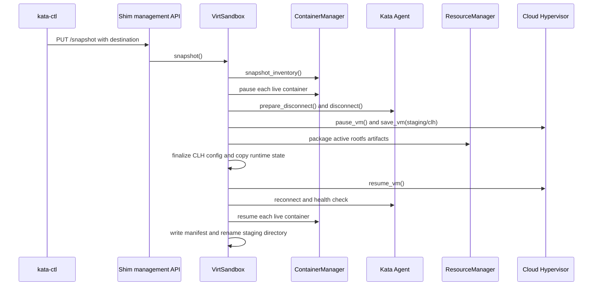
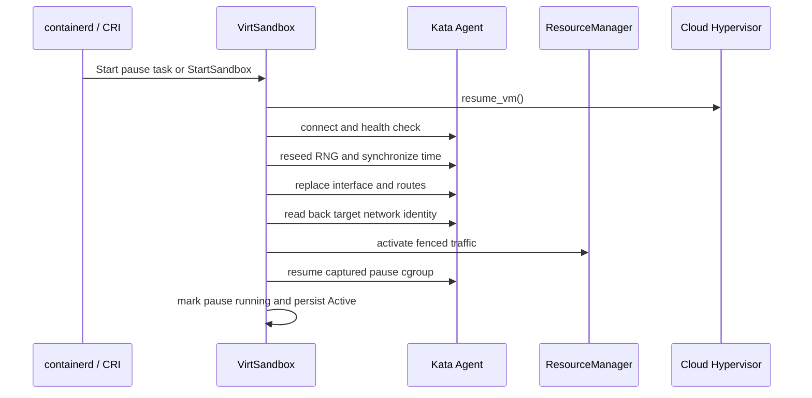

# Runtime-rs Snapshot/Restore Design

Status: implemented through Phase 5

Date: 2026-09-09

Target: `kata-runtime-rs`, Cloud Hypervisor, containerd/CRI, and Kubernetes.

This document describes the implemented packaged snapshot and restore design at
the end of Phase 5. It supersedes the original port proposal where that proposal
described a last-workload barrier, guest-side ID rebinding, resolved-image
digest matching, or `io.katacontainers.restore-from`.

For a line-by-line implementation walkthrough, see
[`RUNTIME-RS-SNAPSHOT-RESTORE-CALL-STACKS-AND-STATE.md`](RUNTIME-RS-SNAPSHOT-RESTORE-CALL-STACKS-AND-STATE.md).

## 1. Goals and boundaries

The implementation provides two operations:

1. `kata-ctl snapshot create` asks a running runtime-rs shim to package a live
   sandbox into a self-contained directory while recovering the source sandbox.
2. A normal CRI sandbox creation carrying
   `io.katacontainers.snapshot-name=<name>` restores that directory beneath the
   configured `runtime.snapshot_root`.

The resulting Pod remains owned by containerd and kubelet. Restore does not
launch an untracked shim and does not provide a snapshot delete operation.

The current design supports:

- Cloud Hypervisor snapshots;
- `copy`, `ondemand`, and `copyonwrite` memory restore modes;
- one target network endpoint with replacement TAP file descriptors;
- self-contained EROFS/VMDK and writable-rootfs artifacts;
- multiple live workload containers;
- live init containers, including restartable sidecars, when they appear as
  ordinary live Pod tasks in the runtime inventory;
- completed Pod containers through synthetic host-side task completion;
- fresh node-local mount content before each adopted container resumes;
- snapshot -> restore -> snapshot recursion;
- stable guest process identity across restore generations;
- exact runtime-version and manifest-version checks.

The current design does not provide:

- live migration or artifact transfer;
- snapshot deletion from Kata;
- QEMU workload restore;
- multiple restored network endpoints;
- cross-runtime or cross-version artifact compatibility;
- compatibility with intermediate development manifests;
- content hashes or signatures in the manifest;
- a Pod-wide image-manifest-digest contract;
- a collective last-workload start barrier;
- guest-side container-ID rebinding.

Artifact transfer, authentication, integrity verification, retention, and
deletion belong to the external controller or artifact service.

## 2. Final architecture

### 2.1 Main owners

| Concern | Owner |
|---|---|
| Snapshot management endpoint | `src/runtime-rs/crates/runtimes/src/shim_mgmt` |
| CLI | `src/tools/kata-ctl/src/ops/snapshot_ops.rs` |
| Snapshot and restore orchestration | `src/runtime-rs/crates/runtimes/virt_container/src/sandbox.rs` |
| Restore state, claims, and ID maps | `src/runtime-rs/crates/runtimes/virt_container/src/restore.rs` |
| Container adoption and synthetic tasks | `src/runtime-rs/crates/runtimes/virt_container/src/container_manager` |
| CLH save/restore and TAP FD passing | `src/runtime-rs/crates/hypervisor` |
| Packaged and restored rootfs resources | `src/runtime-rs/crates/resource/src/rootfs` |
| Agent disconnect/reconnect lifecycle | `src/runtime-rs/crates/agent` |
| Guest interface replacement | `src/agent/src/netlink.rs` |
| Annotation and runtime configuration | `src/libs/kata-types` |

`VirtSandbox` and `VirtContainerManager` share one `RestoreContext`. The
context is the authority for activation state, snapshot slots, claims,
completed-container state, and bidirectional host/guest ID translation.

### 2.2 Restore activation states

The implemented activation state machine is:

```text
Cold
  -> RestoringPaused
  -> PreparedPaused
  -> Activating
  -> Active

Any in-progress restore state -> Failed
```

- `Cold` means normal sandbox behavior.
- `RestoringPaused` means the manifest was accepted and CLH restore preparation
  is in progress.
- `PreparedPaused` means the private VMM has restored successfully and remains
  paused behind a network fence.
- `Activating` serializes sandbox-wide VMM, agent, network, and pause-task
  activation.
- `Active` permits independent workload adoption and starts.
- `Failed` is terminal for that sandbox attempt.

Container adoption is deliberately not represented as a Pod-wide activation
phase. After sandbox activation, each workload follows its own CRI lifecycle.

## 3. Snapshot transaction

Snapshot is one exclusive sandbox transaction:



### 3.1 Serialization and staging

The shim management handler takes the exclusive operation lock. Mutating task
and sandbox requests use the shared side, so create, start, exec, update,
delete, and shutdown cannot overlap capture.

The requested destination must be:

- absolute;
- non-root;
- lexically clean;
- absent before the transaction;
- beneath an existing canonical parent.

The runtime creates a mode-0700 sibling directory named with a unique
`.partial-<uuid>` suffix. It publishes the destination only by renaming that
staging directory after source recovery and manifest creation succeed.

### 3.2 Inventory

`snapshot_inventory()` classifies every current Pod task:

- `Running` and `Paused` tasks become live entries;
- stopped Pod containers become completed entries;
- transitional states such as `Created` reject capture;
- a stopped pause task rejects capture rather than becoming a completed
  workload.

Each live entry records its current host ID, stable guest-agent ID, CRI name,
canonical OCI identity, node-local mount mappings, and rootfs artifacts.

This classification is lifecycle-based, not Kubernetes-class-aware. A
restartable init sidecar that appears as a live Pod task is a live slot, while
an init container that already exited is a completed slot.

### 3.3 Quiescence and source recovery

The source sequence is strict:

1. Suspend health monitoring.
2. Pause every live guest container while the agent is connected.
3. Enter planned disconnect and drain non-replayable writes.
4. Disconnect the agent transport and wait for the guest server to listen.
5. Pause the VMM.
6. Save CLH, rootfs, runtime, and manifest inputs.
7. Resume the VMM.
8. Reconnect and health-check the source agent.
9. Resume the source containers in reverse order.
10. Resume health monitoring.

Long-running waits are generation-aware. A planned disconnect does not mark a
process stopped, synthesize exit code 255, or publish `TaskExit`; the request is
reattached after reconnect. Legacy stream I/O quiesces writes before disconnect
and reopens reads after reconnect. Passfd payload transport remains outside the
TTRPC stream path, but its wait request follows the same generation lifecycle.

Recovery is attempted after every post-pause outcome. A valid CLH snapshot does
not make the operation successful if the source sandbox cannot be returned to a
known usable state.

## 4. Artifact contract

### 4.1 Layout

Format version 1 uses this layout:

```text
<snapshot>/
  kata-snapshot.json
  runtime-state.json
  clh/
    config.json
    state.json
    memory-ranges
  containers/
    <source-host-id>/
      rootfs.vmdk
      gpt-head.img
      padding-<n>.img
      lower-<n>.erofs
      rwlayer.img
```

Files under a container directory depend on the rootfs mode. The source host ID
is a generation-specific storage key, not the restore identity used to match a
future CRI request.

`kata-snapshot.json` is written last and serves as the completion marker.

### 4.2 Manifest schema

The implemented manifest contains:

```json
{
  "runtime_version": "...",
  "format_version": 1,
  "producer": "runtime-rs",
  "hypervisor": "cloud-hypervisor",
  "source_sandbox_id": "...",
  "agent_transport": {
    "contract_version": 1,
    "state": "disconnected-listening",
    "server_port": 1024,
    "log_port": 1025
  },
  "live_containers": [
    {
      "cri_name": "POD or workload name",
      "source_host_id": "...",
      "snapshot_guest_id": "...",
      "oci_identity_version": 1,
      "oci_identity_sha256": "sha256:...",
      "node_local_mounts": [
        { "destination": "...", "guest_source": "..." }
      ],
      "readonly_disk_id": "...",
      "readonly_disk": "containers/.../rootfs.vmdk",
      "writable_disk_id": "...",
      "writable_disk": "containers/.../rwlayer.img"
    }
  ],
  "completed_containers": [
    {
      "cri_name": "...",
      "exit_code": 0,
      "oci_identity_version": 1,
      "oci_identity_sha256": "sha256:..."
    }
  ],
  "files": [
    { "path": "...", "size": 0 }
  ]
}
```

Optional writable fields are `null` together when no host writable disk exists.
Serde rejects unknown manifest fields.

The manifest intentionally records structural file inventory and sizes, not
payload hashes. It also does not record a resolved image manifest digest.
Artifact integrity and image provenance must therefore be established by the
system that transports and admits artifacts. Runtime restore validates the
manifest contract, paths, regular-file types, declared sizes, disk IDs, unique
CRI names, unique host/guest IDs, and canonical OCI identity.

### 4.3 Versioning

Restore requires all of the following:

- the exact current Kata runtime release version;
- manifest format version 1;
- producer `runtime-rs`;
- hypervisor `cloud-hypervisor`;
- agent transport contract version 1 in `disconnected-listening` state.

The preview format has no migration path. A schema change requires a format
version decision and regenerated artifacts.

### 4.4 VMDK and memory portability

Runtime-rs rootfs VMDKs describe EROFS and generated GPT extents. Packaging
copies every required extent into the artifact and emits a descriptor whose
extent paths are artifact-local. A writable raw layer is reflinked or
sparse-copied into the artifact.

CLH `config.json` disk paths are rewritten to packaged paths. Live
`extent_anchor_path` values are removed from packaged descriptors. When CLH
produces `memory-ranges`, host-local top-level and zone memory `file` references
are removed so restore uses the portable snapshot memory.

During restore, read-only packaged files stay in the snapshot directory. Every
writable disk receives a private sparse copy beneath the new sandbox runtime
directory; the immutable artifact is never attached writable.

## 5. Restore transaction

### 5.1 Selection and source validation

Restore enters through normal sandbox creation. Only a Pod sandbox task may use
`io.katacontainers.snapshot-name`.

The annotation value must be one normal path component. It is resolved beneath
the adjusted `runtime.snapshot_root`, whose default is
`/var/lib/kata/snapshots`. Both the configured root and selected snapshot must
be absolute, canonical directories without symlinked components.

The manifest and every declared file are validated before CLH launch. Relative
artifact paths must remain beneath the snapshot directory and identify regular
files.

### 5.2 Paused VMM preparation

Restore creates private mutable state, including a private CLH config and
writable disk copies. It registers restored rootfs resources, stages the target
CNI endpoint with traffic fenced, and passes replacement TAP queue FDs to CLH.

The selected `memory_restore_mode` comes from the target node configuration.
`copyonwrite` cannot be combined with virtio-mem. CLH restore must report the
VMM in `Paused`; any other state is fatal.

`RestoreContext::begin()` receives the complete live and completed inventories.
The required pause identity is the live slot named `POD`; there is no duplicate
`source_pause_guest_id` argument.

### 5.3 Sandbox activation

The pause task can be adopted while the VMM is prepared and paused. Its
`Start` request, or `StartSandbox` in the sandbox API, owns the serialized
sandbox activation:



Activation is complete before workload adoption begins. There is no
last-workload barrier and no collective guest rebind operation.

### 5.4 Live-container adoption

After activation, each incoming workload `CreateContainer` is independently
classified by exact CRI name and canonical OCI identity:

- a matching live slot is claimed and adopted without guest `CreateContainer`;
- a matching completed slot becomes a synthetic host task;
- while unclaimed snapshot slots remain, an unknown name fails closed;
- after snapshot slots are consumed, a genuinely new container follows the
  cold-create path.

An adopted live container remains paused until its own `StartContainer`:

1. Reconcile the target generation's node-local mount content.
2. Arm host I/O and `WaitProcess` against the stable guest identity.
3. Send `ResumeContainer` for that guest identity.
4. Publish the current host task as running.

One workload does not wait for another workload's Create or Start request.
This avoids deadlock when kubelet/containerd serialize lifecycle calls and
allows later ephemeral containers after restore.

### 5.5 Completed containers

A container that had stopped before snapshot is represented locally:

- Create installs a synthetic task in `Created` state.
- Start publishes `TaskStart`, completes the local process with the recorded
  exit code, and releases its waiter to publish `TaskExit`.
- State and Wait return the recorded completion.
- Delete removes local synthetic state and makes that snapshot slot unavailable.

No agent, rootfs attachment, or OCI hook is invoked for synthetic completion.
If a restart policy later creates the same CRI name after the synthetic task is
consumed, the replacement follows the cold path.

## 6. Identity model

### 6.1 Host and guest identities

A restored process has two identities:

```text
HostContainerId H = ID assigned by this containerd generation
GuestContainerId G = stable ID captured inside the guest
```

The runtime stores typed IDs and maintains both directions:

```text
host_to_guest: HashMap<HostContainerId, GuestContainerId>
guest_to_host: HashMap<GuestContainerId, HostContainerId>
```

These maps are installed atomically with a live-slot claim and persisted in
normal sandbox state. They are not a temporary activation journal.

Host-facing task state, hooks, and containerd events use `H`. All agent RPCs
for the captured process use `G`. Inbound guest events such as OOM reports are
translated from `G` back to `H`.

`Process` stores both the current host-facing `ContainerProcess` and its
agent-facing `ContainerProcess`. Exec processes inherit the parent container's
guest container ID while retaining their current exec ID.

The agent transport does not translate IDs. Callers must construct
identity-bearing requests from the typed guest identity. The
`HostContainerId`/`GuestContainerId` newtypes guard restore APIs against
accidental role reversal.

### 6.2 Recursive generations

The guest ID remains stable across generations:

```text
source host H0 -> guest G
first restore host H1 -> guest G
second restore host H2 -> guest G
```

When a restored sandbox is snapshotted, inventory reads `G` from each
container's agent-facing process and packages storage under the current host ID.
The next restore creates a new host mapping to the same `G`.

Deleted adopted containers retire both map directions and their restored rootfs
resources. Snapshot config finalization also removes inactive restored disk
entries, using the configured `runtime.snapshot_root` rather than assuming its
default value.

## 7. Node-local data and networking

### 7.1 Node-local mounts

The manifest records guest destinations and captured guest source paths for
node-local mounts. On adoption, the target OCI spec supplies current host-side
content. Runtime-rs refreshes the existing guest mount destinations before the
container resumes.

This covers copied inputs such as hosts, hostname, resolver data, ConfigMaps,
Secrets, projected files, service-account tokens, downward API data, and
termination-message mappings where represented by the supported volume path.
Unsupported mappings fail rather than silently substituting an unrelated path.

### 7.2 Network replacement

Restore supports exactly one non-loopback endpoint. Host network preparation
retains TAP queue FDs but defers traffic redirection. CLH receives those FDs in
the restore request, preserving the saved virtio-net device rather than adding
a second guest NIC.

After agent reconnect, runtime-rs replaces interface identity, installs routes,
and reads the interface back. Traffic is activated only after the target
MAC/address set is present and source-only addresses are absent.

## 8. Failure and security model

### 8.1 Snapshot guarantees

- Snapshot mutation is serialized with sandbox mutations.
- Partial output is private and uniquely named.
- The final destination appears only after successful source recovery.
- Primary and recovery failures are both reported.
- Kata never recursively deletes a finalized caller-owned artifact.

### 8.2 Restore guarantees

- Restore paths are constrained beneath the configured snapshot root.
- Manifest paths are relative, beneath the artifact, canonical, and regular.
- CLH remains paused until sandbox activation.
- Target traffic remains fenced until network verification.
- Writable artifact state is privately cloned.
- Activation is single-flight.
- A failed restore enters terminal `Failed` and cleanup stops the private VMM
  before releasing resources.
- OCI hooks are rejected on adopted tasks because replay semantics are undefined.

### 8.3 Trust boundary

The runtime validates structure and semantic OCI identity, but the format does
not authenticate payload bytes. A deployment must admit snapshots only from a
trusted artifact pipeline or add external signature/hash/fs-verity validation.

The annotation selects only a name, not an arbitrary path, but authorization to
request restore remains a cluster policy concern.

## 9. Phase outcomes

| Phase | Final result |
|---|---|
| 1 | Hypervisor save/restore separated from factory policy; CLH restores paused with memory mode and replacement network FDs. |
| 1.5 | Runtime-rs VMDK image type and extent-anchor support completed. |
| 2 | Transactional packaged snapshot endpoint, manifest, rootfs capture, private staging, and source recovery implemented. |
| 2.5 | Planned agent disconnect/reconnect, reconnect-aware waits and I/O, init/completed accounting, and mutation locking implemented. |
| 3 | Annotation-selected paused restore, private artifact preparation, pause adoption, and sandbox/network activation implemented. |
| 4 | Independent multi-container adoption, completed-task synthesis, typed persistent ID maps, mount refresh, new-container support, and recursive restore implemented. |
| 5 | Duplicate-layer handling, configured snapshot selection, packaged debug/release configs, annotation rename, and strict Kata runtime version matching implemented. |

The phase split is implementation history, not a runtime protocol. The artifact
contract is defined by its manifest and exact runtime-version check.

## 10. Validation status and remaining work

Implemented unit/component coverage includes:

- CLH restore request construction and paused-state enforcement;
- memory restore mode validation;
- manifest schema, version, path, file-size, and disk-ID checks;
- source agent planned disconnect and generation handling;
- canonical OCI identity normalization and mismatch detection;
- live-slot claiming and typed bidirectional ID maps;
- persisted restore state and stable recursive guest IDs;
- synthetic completed-container lifecycle;
- VMDK and writable-rootfs packaging;
- custom snapshot-root handling for inactive restored disks;
- guest network identity replacement and readback helpers.

Live validation has demonstrated non-templated restore, target network identity,
writable-rootfs preservation, exec after restore, completed init synthesis, and
snapshot -> restore -> snapshot -> restore.

The following remain deployment or follow-up validation concerns rather than
implemented artifact guarantees:

- authenticated artifact transport and payload integrity;
- broad failure injection across every source-recovery and restore stage;
- high-count multi-container and multi-layer Kubernetes matrices;
- quantitative COW RSS/PSS validation across concurrent clones;
- measured reconnect-latency thresholds on production kernels and CLH builds;
- explicit policy for snapshots taken after unsupported VM memory resize;
- multi-endpoint networking and non-CLH hypervisors.

## 11. Design rules for future changes

1. Preserve stable guest IDs; do not silently send current host IDs to the
   restored agent.
2. Keep `HostContainerId` and `GuestContainerId` distinct until an external
   string/protobuf boundary requires conversion.
3. Do not add a Pod-wide workload barrier unless CRI ordering provides a
   demonstrated need that independent adoption cannot satisfy.
4. Keep the artifact immutable and clone every mutable disk privately.
5. Resolve restore names only beneath configured `runtime.snapshot_root`.
6. Treat manifest schema and runtime-version changes as explicit compatibility
   decisions.
7. Do not infer rootfs ancestry from filenames; use manifest disk IDs and typed
   rootfs resources.
8. Preserve source recovery as part of snapshot success.
9. Keep network traffic fenced until guest readback proves target identity.
10. Add identity-bearing agent operations through guest-ID-aware constructors
    or typed APIs; the transport itself performs no mapping.
