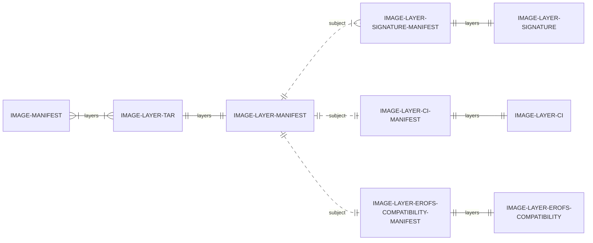
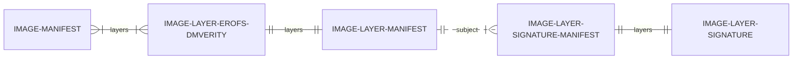

# Code Integrity for OCI Containers Roadmap

The purpose of this issue is to track the roadmap for the Code Integrity for OCI
Containers project.

The goal is to ensure that when a container is running, its integrity is
enforced by kernel in the runtime
([dm-verity](https://www.kernel.org/doc/html/latest/admin-guide/device-mapper/verity.html))
and further, only binaries that come from the original container image layers
are allowed to run
([IPE](https://docs.kernel.org/next/admin-guide/LSM/ipe.html)). Finally, we
would like to achieve these goals seamlessly, such that not everybody is
required to update the build and runtime environments, by leveraging integration
with OCI registries.

The rest of the document outlines the milestones we envision to achieve the
stated goals.

## Milestones

### Milestone 1: Initial Integration with containerd/erofs-snapshotter

The purpose of this milestone is to enable the basic building blocks required
for the Code Integrity for OCI Containers project. This includes support for tar
index, dm-verity, and dm-verity signatures in the erofs-snapshotter.

As part of the initial milestone, we would like to extend the
erofs-snapshotter with the following features:

1. Add a second method for image layer tar to erofs conversion in the erofs
   snapshotter by leveraging the tar index mode. This is a prerequisite for the
   next milestone, so that the index, which is much smaller than the full erofs
   blob, can be generated ahead of time and pulled from the registry (instead of
   being generated on the fly on the container host). It will also serve as a
   consistent fallback for the next milestone, in case the tar index is not
   available in the registry.

2. Finalize the dm-verity support in the erofs
   snapshotter, so that the converted image layers can be backed by a dm-verity
   block device. This will allow the kernel to check the integrity of any file that
   is part of image layers in the runtime. As part of the initial milestone, the
   dm-verity Merkle tree will be generated on the fly on the container host.

3. Extend the dm-verity support with logic to pull per-layer dm-verity root hash
   signatures. This will establish provenance for each layer, recognized by the
   kernel. This is a prerequisite for leveraging IPE at scale for all the
   container image layers. We envision that the
   signatures would be pulled from the registry and tied to image layers by
   leveraging the OCI referrers feature. Tying the signatures to the layers
   directly, as opposed to the image manifest, will allow the signatures to be
   reused across different image manifests.

   ```mermaid
   erDiagram
     direction LR
     IMAGE-MANIFEST }|--|{ IMAGE-LAYER-TAR: layers
     IMAGE-LAYER-TAR ||--|| IMAGE-LAYER-MANIFEST: layers
     IMAGE-LAYER-MANIFEST ||..|{ IMAGE-LAYER-SIGNATURE-MANIFEST: subject
     IMAGE-LAYER-SIGNATURE-MANIFEST ||--|| IMAGE-LAYER-SIGNATURE: layers
   ```

### Milestone 2: Populating erofs tar index and dm-verity Merkle tree

The purpose of this milestone is to allow generation of the erofs tar index and
the dm-verity Merkle tree ahead of time, so that the container host does not
need to generate them on the fly. This will lead both to a faster cold container
startup and also to reduce the overall energy needed (by doing the
operation once, instead of on every host).

The plan is to extend the erofs-snapshotter by fetching the tar index and
dm-verity Merkle tree from the registry. If the artifacts are not available from
the registry, the logic from the initial milestone will be used as a fallback to
generate the index and Merkle tree on the fly on the container host.

The actual implementation will leverage OCI referrers to loosely couple the
tar-index and dm-verity Merkle tree with the original image layers, similar to
what has been done for signatures as part of the initial milestone. The
benefit of this approach is that the original image builder does not have to
understand how to generate the tar index and dm-verity Merkle tree, and somebody
else can come after the fact and add these artifacts (to help with onboarding
new users). Further, this means that the
same image layers can be consumed by other containerd snapshotters, that do not
understand erofs or dm-verity.

Leveraging the OCI referrers feature, instead of directly modifying published
artifacts in the registry is a cleaner approach, as the associated manifests
would not have to be regenerated.



The `IMAGE-LAYER-CI` would contain the dm-verity Merkle tree, while the `IMAGE-LAYER-EROFS-COMPATIBILITY` would contain the tar index.

The downside of this approach is that when the snapshotter is preparing the
layers for the first time, it will have to reach out to the registry to fetch
the additional associated artifacts (tar index and dm-verity Merkle tree). To
mitigate the latency cost, we would like to collaborate on [native support for
referrers in containerd](https://github.com/containerd/containerd/issues/7654)
such that containerd could pre-fetch such artifacts ahead of time, as part of
pulling the layers. This would be
beneficial for the signature artifacts as well.

### Milestone 3: Support for native erofs + dm-verity layers

The purpose of this milestone is to deliver the final piece of the puzzle, which
focuses on the native support for erofs and dm-verity layers in
containerd/erofs-snapshotter. This will reduce any performance overhead of the
initial milestones for the teams that can publish and consume native
erofs+dm-verity layers.

At the moment, containerd can leverage image index and select the right image
manifest based on OS and architecture. We would like to extend this further, to
leverage the work done for picking the image manifest based on OS features. This
would enable OCI registry to serve both erofs and legacy layers in parallel and
containerd would [pick the right one based on the OS features of the
host](https://github.com/containerd/platforms/pull/20) and what the registry has
to offer. This means that when erofs layers are published to registry, they
could be downloaded directly, and if they are not available, the solutions from
Milestones 2 and 1 could be used as a fallback.

The benefit of this approach is that it will simplify the amount of different
artifacts that need to be pulled from the registry and thus further speed up the
container startup time.

While the Merkle tree could be still kept as a separate artifact, we would like
to propose that the native erofs layers will contain the Merkle tree as well. More
specifically, we propose that there are native erofs+dm-verity layers, as
opposed to only generic erofs layers. This will simplify the design overall and
improve performance.


