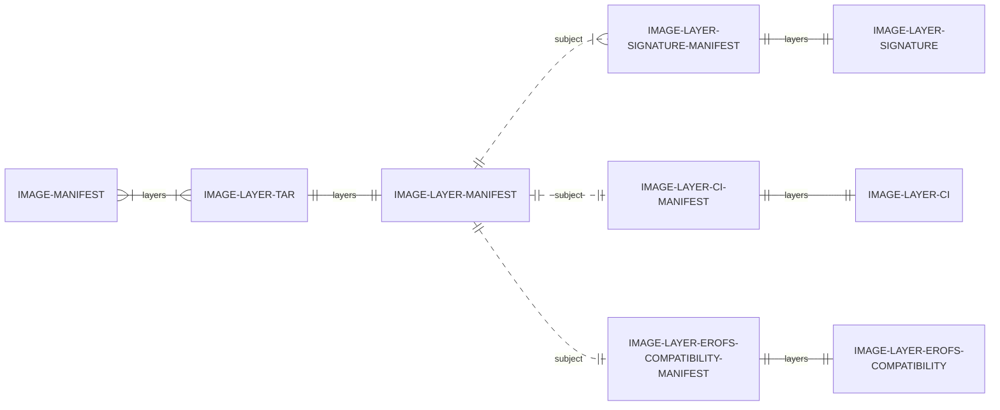
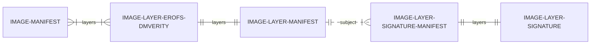

# Roadmap: Code Integrity for OCI/containerd Containers using erofs-snapshotter

This document outlines the strategic roadmap for enhancing code integrity in OCI
Containers through erofs-snapshotter.

## Objective

The primary objective is to ensure that container runtime integrity is enforced
at the kernel level using
[dm-verity](https://www.kernel.org/doc/html/latest/admin-guide/device-mapper/verity.html).
Additionally, only binaries originating from the original container image layers
should be permitted to execute, enforced via
[IPE](https://docs.kernel.org/next/admin-guide/LSM/ipe.html).

To achieve this, each container image layer will be backed by a dm-verity
device. The signed root hash of the corresponding Merkle tree will be provided
to the kernel, enabling provenance validation through kernel keyrings.
Subsequently, an IPE policy can be deployed on the host to restrict execution to
binaries residing on these signed dm-verity block devices.

This approach extends the current containerd model, which verifies artifact
digests during registry downloads but does not enforce artifact integrity
post-pull. By leveraging IPE, we further ensure that only trusted code is
executed.

Our aim is to deliver these capabilities seamlessly, minimizing the need for
modifications to existing build and runtime environments by integrating with OCI
registries.

The following sections detail the milestones required to realize these
objectives.

## Milestones

### Milestone 1: Foundational Integration with containerd/erofs-snapshotter

This milestone establishes the essential components for code integrity in OCI
Containers, including support for tar index, dm-verity, and dm-verity signatures
within the erofs-snapshotter.

Key deliverables:

1. **Tar Index Mode for EROFS Conversion** Introduce an alternative method for
   converting image layer tarballs to EROFS within the snapshotter, utilizing
   tar index mode.

2. **dm-verity Support Finalization** Complete dm-verity integration in the
   erofs-snapshotter, allowing converted image layers to be backed by dm-verity
   block devices. This enables the kernel to verify the integrity of files
   within image layers at runtime. Initially, the dm-verity Merkle tree will be
   generated dynamically on the host.

3. **Layer-Specific dm-verity Root Hash Signatures** Enhance dm-verity support
   by enabling retrieval of per-layer dm-verity root hash signatures. This
   establishes provenance for each layer, recognized by the kernel, and is
   essential for scalable IPE enforcement. Signatures will be fetched from the
   registry and associated with image layers using the OCI referrers feature.
   Associating signatures directly with layers (rather than manifests)
   facilitates signature reuse across multiple image manifests.

   ```mermaid
   erDiagram
     direction LR
     IMAGE-MANIFEST }|--|{ IMAGE-LAYER-TAR: layers
     IMAGE-LAYER-TAR ||--|| IMAGE-LAYER-MANIFEST: layers
     IMAGE-LAYER-MANIFEST ||..|{ IMAGE-LAYER-SIGNATURE-MANIFEST: subject
     IMAGE-LAYER-SIGNATURE-MANIFEST ||--|| IMAGE-LAYER-SIGNATURE: layers
   ```

### Milestone 2: Pre-Population of EROFS Tar Index and dm-verity Merkle Tree

This milestone focuses on generating the EROFS tar index and dm-verity Merkle
tree in advance, eliminating the need for on-the-fly generation on the container
host. This approach accelerates cold container startup and reduces overall
energy consumption by performing these operations once, rather than on every
host.

The erofs-snapshotter will be extended to fetch the tar index and dm-verity
Merkle tree from the registry. If unavailable, the snapshotter will fall back to
generating these artifacts locally, as described in Milestone 1.

Implementation will leverage OCI referrers to loosely associate the tar index
and dm-verity Merkle tree with the original image layers, similar to the
signature mechanism established previously. This decouples artifact generation
from image building, allowing post-publish addition of these artifacts to help
with onboarding. It also ensures compatibility with other containerd
snapshotters that do not support EROFS or dm-verity.

Using OCI referrers, rather than modifying published registry artifacts, is a
cleaner approach that avoids manifest regeneration.



- `IMAGE-LAYER-CI`: Contains the dm-verity Merkle tree.
- `IMAGE-LAYER-EROFS-COMPATIBILITY`: Contains the tar index.

A potential drawback is the need for the snapshotter to fetch additional
artifacts (tar index and Merkle tree) from the registry during initial layer
preparation. To mitigate latency, collaboration is encouraged on [native
referrer support in
containerd](https://github.com/containerd/containerd/issues/7654), enabling
pre-fetching of such artifacts during image pull operations. This would also
benefit signature artifact retrieval.

### Milestone 3: Native Support for EROFS + dm-verity Layers

This milestone aims to deliver native support for EROFS and dm-verity layers in
containerd/erofs-snapshotter, reducing performance overhead for teams capable of
publishing and consuming native EROFS+dm-verity layers.

Currently, containerd selects the appropriate image manifest based on OS and
architecture via the image index. The plan is to extend this mechanism to
consider [OS features](https://github.com/containerd/platforms/pull/20),
allowing the registry to serve both EROFS and legacy layers concurrently.
Containerd will select the optimal layer type based on host OS features and
registry offerings. If native EROFS layers are unavailable, the solutions from
Milestones 2 and 1 will serve as fallbacks.

This approach streamlines artifact retrieval, further accelerating container
startup.

While the Merkle tree could remain a separate artifact, it is proposed that
native EROFS layers embed the Merkle tree, resulting in native EROFS+dm-verity
layers. This simplifies the design, improves performance by consolidating
required artifacts, and facilitates features such as lazy pulling.


